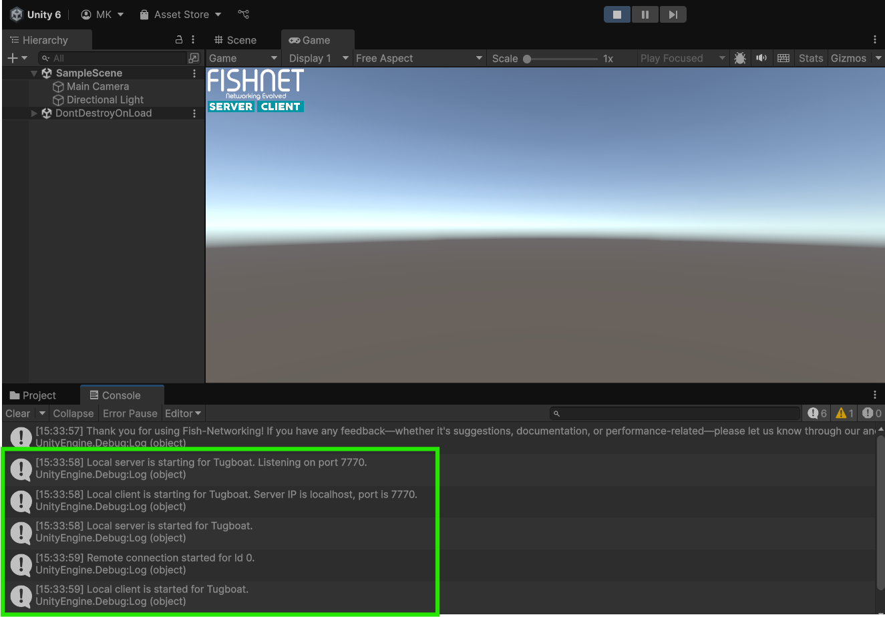

# Getting Connected



#### Creating the NetworkManager

The **NetworkManager** is a central component of FishNet that manages the networking lifecycle, including establishing connections, hosting sessions, and handling client-server communication. For convenience, FishNet has a ready-made NetworkManager prefab that you can use. You can find the prefab located in the FishNet directory under `Demos/Prefabs/NetworkManager.prefab`.\
Drag and drop this NetworkManager prefab into your Unity scene.

<figure><figcaption>
Adding the NetworkManager Prefab
</figcaption></figure>


If you imported FishNet from the git URL instead of the asset store or .unitypackage file, then the location of the FishNet directory will be `Packages/FishNet: Networking Evolved` instead of `Assets/FishNet`




#### Configuring FishNet to Auto Start

The **NetworkHudCanvas** is a user interface provided by the example **NetworkManager** designed for quick testing of network connections. It displays buttons to start as a client and/or server. It also allows you to automatically start as a server, client, or host as soon as the **NetworkManager** loads in the game.

Expand the **NetworkManager's** fold-out icon to see its child game objects and select the **NetworkHudCanvas** game object. Find the **Network Hud Canvases** component on the object and set the **Auto Start Type** to **Host**.

This configuration will ensure that the application automatically starts as a host (a server and a client at the same time) when the scene is loaded.

<figure><figcaption>
Setting the Auto Start Type
</figcaption></figure>



#### Testing the Connection

Once everything is set up, press the Play button in Unity's Editor to launch your scene.

The two Server and Client buttons in the top left of the game window should turn blue to indicate that the server and both active.


If the buttons do not look like the example image then it just means your project is using Unity's new input system package; this is not a problem and you can simply check if the server and client are started by the button names being "Stop Server" and "Stop Client" respectively.


Additionally the console will log some network-related messages. Successful connection messages should appear, indicating that the host and client are running properly.

<figure><figcaption>
Successful connection logs
</figcaption></figure>




You willl see following warning: "Player prefab is empty and cannot be spawned for connection 0."

This is fine and will be dealt with in the next section.


By following these steps, you should now have a functional network setup in your Unity project using FishNet. This guide provides the foundation for more complex networking workflows, such as syncing objects and managing connections.&#x20;


Download the project files with these completed steps here, or explore the repository:

<a href="https://github.com/maxkratt/fish-networking-getting-started/releases/download/getting-connected/getting-connected-complete.unitypackage" class="button primary" data-icon="down-to-line">Source Files</a> <a href="https://github.com/maxkratt/fish-networking-getting-started/tree/getting-connected" class="button secondary" data-icon="github">Repository</a>

