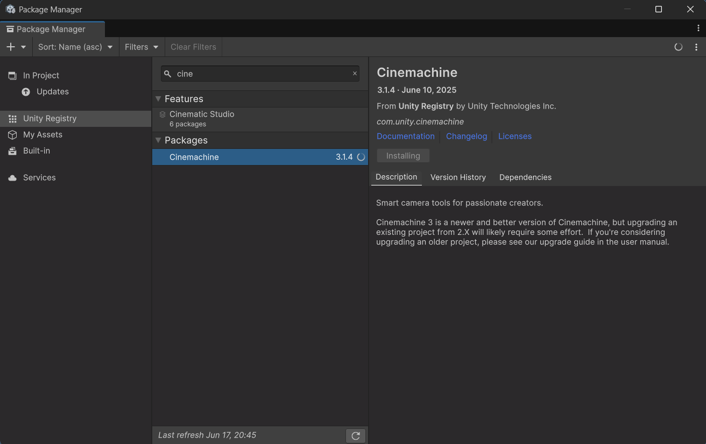
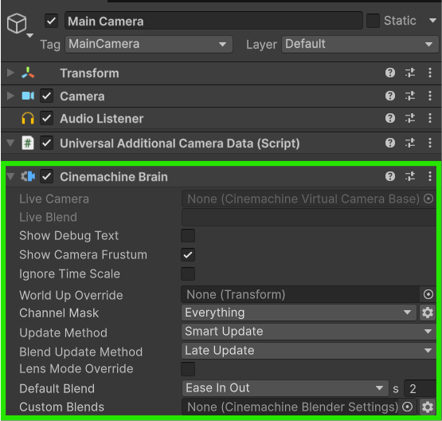
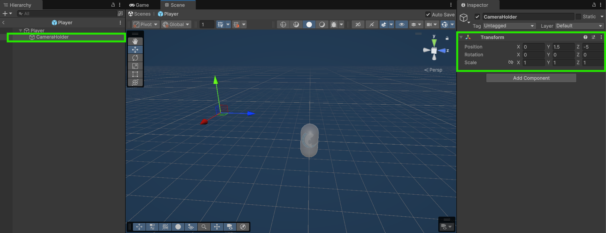
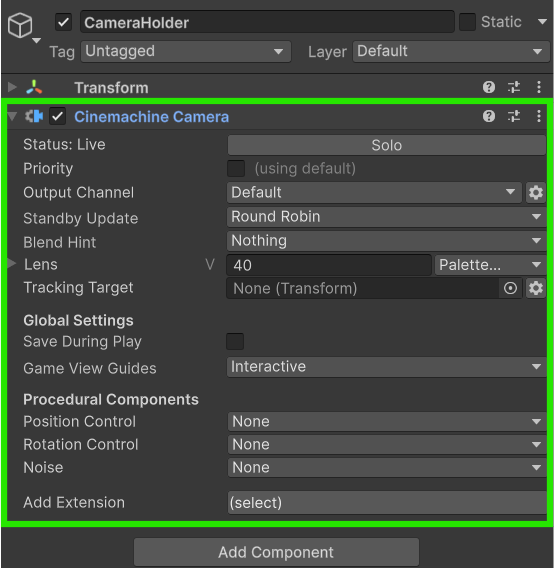
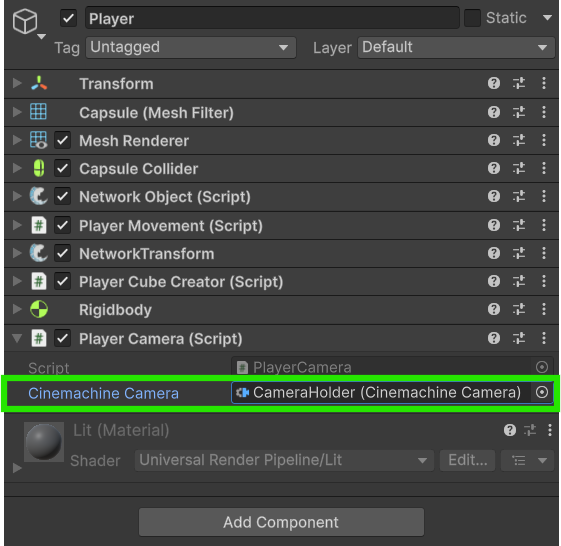

# Basic Setup with Cinemachine

This guide will show you one way you can set-up your player camera for multiplayer when you are using the Cinemachine package.



### Installing Cinemachine

The first step — if you haven't done so already — is to install [Cinemachine](https://unity.com/features/cinemachine) through the [Unity Package Manager](https://learn.unity.com/tutorial/the-package-manager).

<figure><figcaption><p>Cinemachine Installing</p></figcaption></figure>



### Adding the Cinemachine Brain

Now that we have **Cinemachine** installed we can set it up. Add the **Cinemachine Brain** component to the **Main Camera** game object in the scene.

<figure><figcaption><p><strong>Cinemachine Brain</strong> added to <strong>Main Camera</strong></p></figcaption></figure>



### Giving the Player a Camera Holder

Now create an empty Game Object on your **Player Prefab** and position it where you'd like. This will be our container for the **Cinemachine** **Camera**.

<figure><figcaption><p>Camera Holder created on the Player Prefab</p></figcaption></figure>



### Adding the Cinemachine Camera

Now simply add the **Cinemachine Camera** component to the newly created **CameraHolder** game object.

<figure><figcaption><p>The <strong>Cinemachine Camera</strong> added to the <strong>Camera Holder</strong></p></figcaption></figure>



### Writing a PlayerCamera Script

Let's now add the following script to the **Player Prefab** that we will use to take control of our **Camera** once our player spawns in.


```csharp
using FishNet.Object;
using Unity.Cinemachine;
using UnityEngine;

// This script will be a NetworkBehaviour so that we can use the OnStartClient override.
public class PlayerCamera : NetworkBehaviour
{
    [SerializeField] private CinemachineCamera cinemachineCamera;

    // This method is called on the client after the object is spawned in.
    public override void OnStartClient()
    {
        // Simply enable our local cinemachine camera on the object if we are the owner.
        cinemachineCamera.enabled = IsOwner;
    }
}
```


This script uses the [OnStartClient](../../features/networked-gameobjects-and-scripts/network-behaviour-guides.md#onstartclient) override method from [NetworkBehaviour](../../features/networked-gameobjects-and-scripts/network-behaviour-guides.md) to enable or disable the **Cinemachine Camera** component on the player objects depending on if they are our local player or not.



### Assign your References to the Script

Now select the **Player Camera** component in your **Player Prefab** and add drag the **Camera Holder** game object into the _Cinemachine Camera_ field to assign it the component.

<figure><figcaption><p>The <strong>Player</strong> prefab with the <strong>Cinemachine Camera</strong> field filled in</p></figcaption></figure>



### Test the Camera In-Game

With all that set you should be able to run the game and see how the camera from the scene is controlled by only your local player.

<figure><figcaption><p>Demonstration of the local camera</p></figcaption></figure>




Download the project files with these completed steps here, or explore the repository:

<a href="https://github.com/maxkratt/fish-networking-getting-started/releases/download/basic-setup-with-cinemachine/basic-setup-with-cinemachine.unitypackage" class="button primary">Source Files</a> <a href="https://github.com/maxkratt/fish-networking-getting-started/tree/basic-setup-with-cinemachine" class="button secondary">Repository</a>

