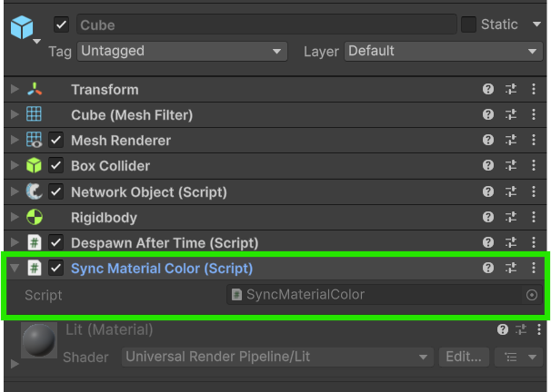
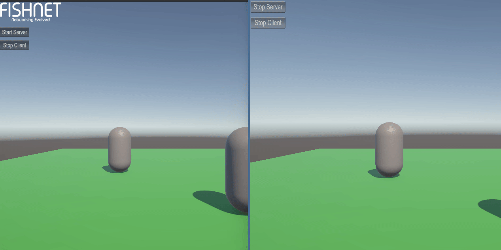

# Using SyncVars to Sync Colors

We've got quite a few things synchronized now, but how would you synchronize a specific variable in one of your scripts? SyncVars[^1] are one answer! A [SyncVar](../features/network-communication/synchronizing/syncvar.md) is a FishNet generic type that can be used within [NetworkBehaviours](../features/networked-gameobjects-and-scripts/network-behaviour-guides.md) that automatically synchronize their value from the server to all clients.

Let's liven up the colors in our game and synchronize them with SyncVars.



### Creating a Script to Sync Color

Create  a new script called `SyncMaterialColor`. This will be used to synchronize the **Material** color of our **MeshRenderers**.


```csharp
using FishNet.Object;
using FishNet.Object.Synchronizing;
using UnityEngine;

[RequireComponent(typeof(MeshRenderer))]
public class SyncMaterialColor : NetworkBehaviour
{
    public readonly SyncVar<Color> color = new SyncVar<Color>();

    void Awake()
    {
        color.OnChange += OnColorChanged;
    }

    private void OnColorChanged(Color previous, Color next, bool asServer)
    {
        GetComponent<MeshRenderer>().material.color = color.Value;
    }
}
```


This simple script has a `color` variable of the type `SyncVar<Color>`. It needs be set to `readonly`, but don't worry, we can still get and set its `Value`.


Setting your **SyncVar** as `readonly` will cause it to be hidden from the Unity Inspector. You can read about a work-around for this [here](../features/network-communication/synchronizing/customizing-behavior.md).


In `Awake` we subscribe to the SyncVar's `OnChange` event. This event is very useful as it will be invoked as soon as the SyncVar changes, even on a client when the server changes it and it's synced.

`OnColorChanged` is our method that we subscribed to the OnChange event. This method simply gets the MeshRenderer and sets its material color to the SyncVar's Color Value, thus updating the visuals to match on all devices.


You may want to read more about **SyncVars** and the other available **SyncTypes** that FishNet has, such as **SyncLists.** You can find those pages [here](../features/network-communication/synchronizing/).




### Add the Script Component

Now add your newly created script to your **Cube Prefab**. The script won't currently do anything unless we change the `color` **SyncVar** in it, so let's do that next.

<figure><figcaption><p>The Sync Material Color Component Added</p></figcaption></figure>



### Give the Cubes Random Colors

Let's give the cubes some color now as soon as we instantiate them.

Reopen the `PlayerCubeCreator.cs` script and make the following addition as show on line 24:

```csharp
obj.GetComponent<SyncMaterialColor>().color.Value = Random.ColorHSV();
```



<pre class="language-csharp" data-title="PlayerCubeCreator.cs" data-line-numbers><code class="lang-csharp">using FishNet.Object;
using UnityEngine;

public class PlayerCubeCreator : NetworkBehaviour
{
    public NetworkObject cubePrefab;

    void Update()
    {
        // Only the local player object should perform these actions.
        if (!IsOwner)
            return;

        if (Input.GetButtonDown("Fire1"))
            SpawnCube();
    }

    // We are using a ServerRpc here because the Server needs to do all network object spawning.
    [ServerRpc]
    private void SpawnCube()
    {
        NetworkObject obj = Instantiate(cubePrefab, transform.position, Quaternion.identity);
<strong>
</strong><strong>        obj.GetComponent&#x3C;SyncMaterialColor>().color.Value = Random.ColorHSV();
</strong><strong>
</strong>        Spawn(obj); // NetworkBehaviour shortcut for ServerManager.Spawn(obj);
    }
}

</code></pre>



<pre class="language-csharp" data-title="PlayerCubeCreator.cs" data-line-numbers><code class="lang-csharp">using FishNet.Object;
using UnityEngine;
using UnityEngine.InputSystem;

public class PlayerCubeCreator : NetworkBehaviour
{
    public NetworkObject cubePrefab;

    public override void OnStartClient()
    {
        if (IsOwner)
            GetComponent&#x3C;PlayerInput>().enabled = true;
    }

    public void OnFire(InputAction.CallbackContext context)
    {
        if (context.started)
            SpawnCube();
    }

    // We are using a ServerRpc here because the Server needs to do all network object spawning.
    [ServerRpc]
    private void SpawnCube()
    {
        NetworkObject obj = Instantiate(cubePrefab, transform.position, Quaternion.identity);
<strong>        
</strong><strong>        obj.GetComponent&#x3C;SyncMaterialColor>().color.Value = Random.ColorHSV();
</strong><strong>        
</strong>        Spawn(obj); // NetworkBehaviour shortcut for ServerManager.Spawn(obj);
    }
}
</code></pre>



This line of code gets the **SyncMaterialColor** component and sets the SyncVar Value to a random color as soon as it's instantiated. Once Spawn is called on the next line, FishNet will spawn this object for all clients with the color SyncVar state synced.



### Test the Synchronized Cubes

Now all you need to do is run your game again and see if the cubes spawn with a random color and if that color is synchronized across the network.

<figure><figcaption><p>Cube Color Synchronized!</p></figcaption></figure>




Download the project files with these completed steps here, or explore the repository:

<a href="https://github.com/maxkratt/fish-networking-getting-started/releases/download/using-syncvars-to-sync-colors/using-syncvars-to-sync-colors.unitypackage" class="button primary">Source Files</a> <a href="https://github.com/maxkratt/fish-networking-getting-started/tree/using-syncvars-to-sync-colors" class="button secondary">Repository</a>


[^1]: synchronized variables
