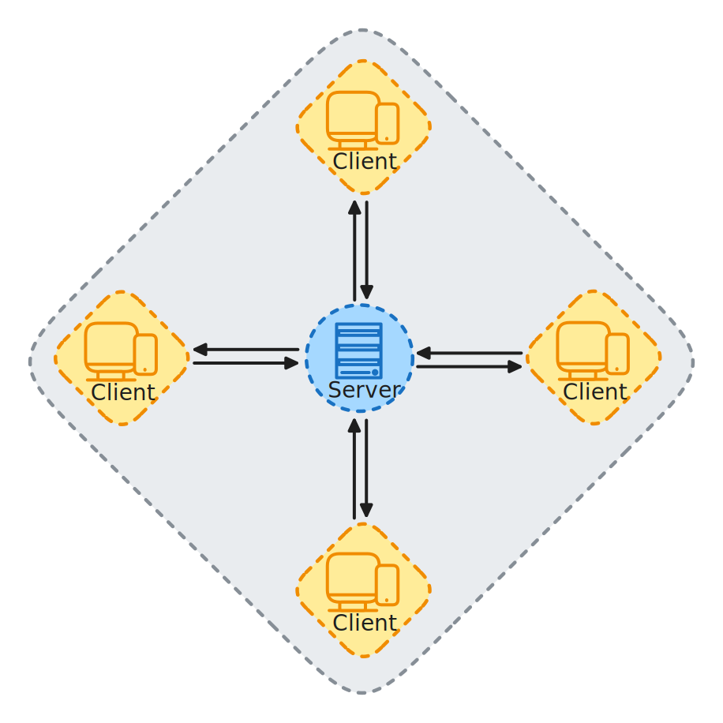
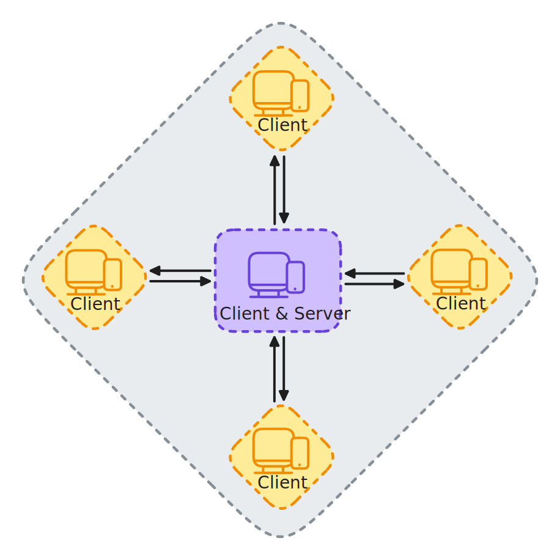
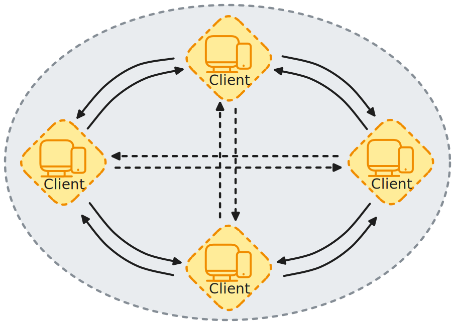
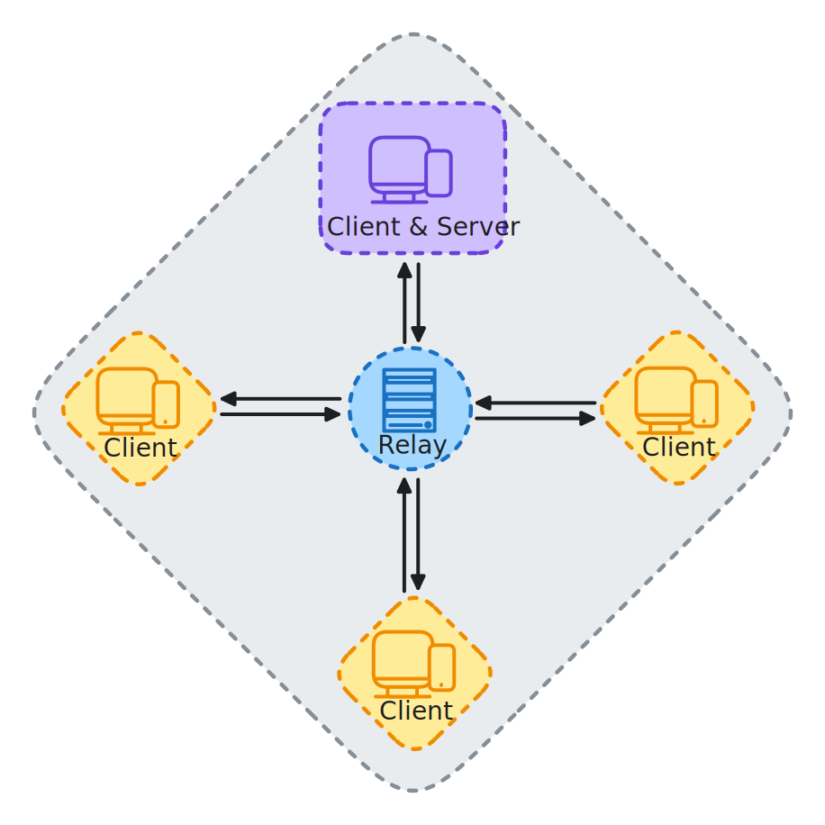

# Networking Models

## Client-Server Architecture

The **client-server model** is the most widely used approach in multiplayer networking. In this model:

* **Server**: The authoritative instance of the game. It manages game logic, synchronizes game state, validates player actions, and handles communication between clients.
* **Client**: A player's instance of the game. It sends input to the server and receives updates about the game state.

There are two main types of servers:

### **Dedicated Server**

The server runs as its own process, separate from any player. It’s more secure and scalable, commonly used in competitive or large-scale games.

<figure><figcaption>
A dedicated server model
</figcaption></figure>

As you can see from the above diagram, the clients (players) are all connected directly to the server and communicate with it instead of with each other.

***

### **Host (Listen Server)**

The server and one of the clients run in the same process. This is common in smaller games or development environments.

<figure><figcaption>
A listen-server model
</figcaption></figure>

The above diagram demonstrates how the listen server is similar to the dedicated server model where all clients connect directly with the server, but unlike the dedicated server, the listen server is also acting as a client (player).


FishNet supports both dedicated and host server models out of the box.


***

## Peer-to-Peer (P2P)

In **peer-to-peer networking**, each player (or peer) connects directly to others without a central server. This reduces latency and server costs but comes with challenges:

* Poor security and cheating prevention
* Difficult to synchronize game state reliably
* NAT traversal issues

<figure><figcaption>
A Peer-to-peer model
</figcaption></figure>

P2P is rarely used in modern real-time multiplayer games, especially competitive ones, due to these drawbacks. FishNet does not use P2P, as it is designed around the client-server model for reliability and security.


Very often a listen server setup is referred to as P2P, FishNet does support a listen server.


***

## Relay Servers

Sometimes clients are unable to connect directly to the server due to **NAT (Network Address Translation)** or **firewall** restrictions. A **relay server** acts as a middleman to forward traffic between clients and the server.

<figure><figcaption>
A relay server
</figcaption></figure>

Relay servers:

* Allow connectivity when direct connections fail
* Introduce additional latency
* May be used as a fallback or for web-based games


Fish-Networking supports multiple third-party relay services including [Unity's Relay](https://unity.com/products/relay), [Edgegap's Distributed Relay](https://edgegap.com/platform/distributed-relay), [Photon Realtime](https://www.photonengine.com/Realtime), [Epic Online Services' Relay Service](https://dev.epicgames.com/docs/epic-online-services/eos-overview#peer-to-peer-p2p-connections), and [Steam Datagram Relay](https://partner.steamgames.com/doc/features/multiplayer/steamdatagramrelay).


***

### Host Migration

When using a listen server, the host leaving the game would cause all players to leave the game; **Host migration** is a feature for maintaining game sessions in the event the current host disconnects or experiences network issues. It enables a new host to be elected from the remaining connected players, minimizing disruption and ensuring the game session can continue seamlessly.


Fish-Networking doesn't yet have built-in host migration, but it is a feature that may be added in the future.

