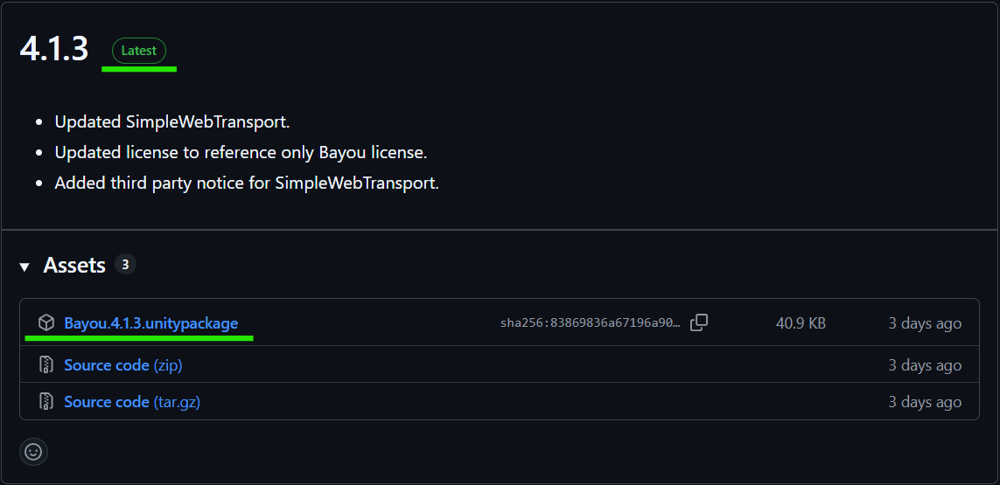
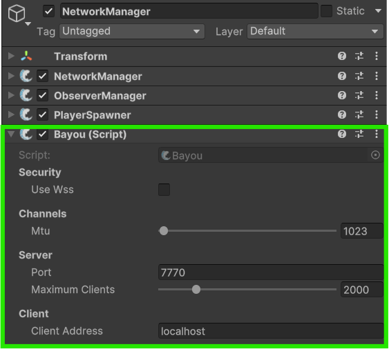
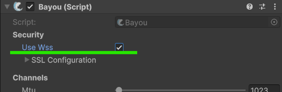
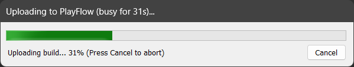
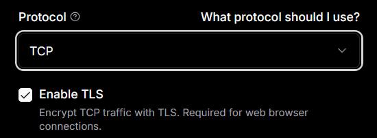
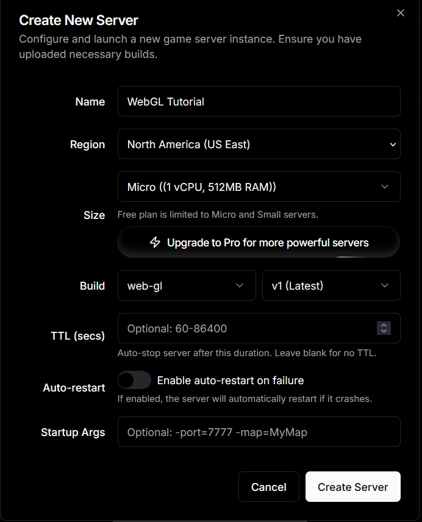
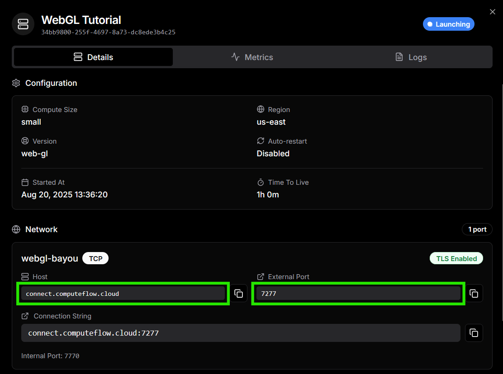
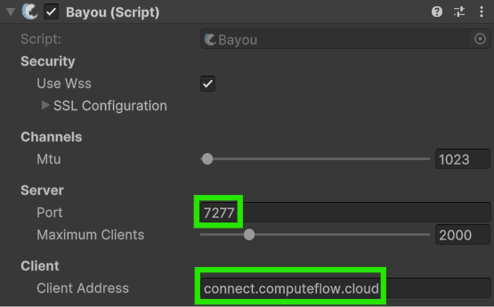
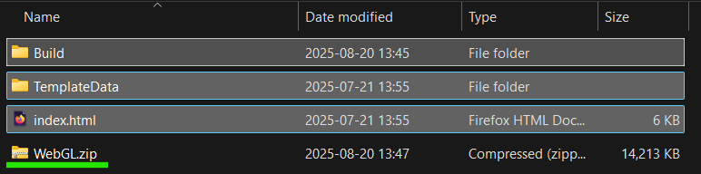
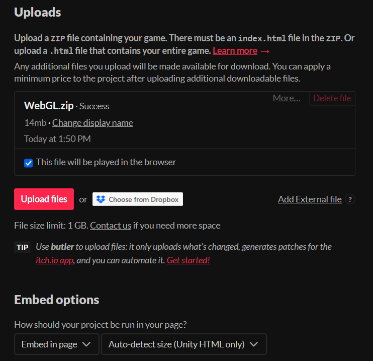

# Easy WebGL hosting with PlayFlow

## How PlayFlow makes WebGL hosting easy

For seamless WebGL gaming experiences in web browsers, secure WebSocket connections are crucial, but configuring them can be complex. Often, developers end up managing certificates and networking issues, which can be time-consuming. **With PlayFlow,** however, you only need to enable a simple option to handle these concerns effortlessly.

## Before we begin...

This tutorial assumes you've read the [getting-started-with-playflow.md](getting-started-with-playflow.md "mention") tutorial already. In the following steps we will convert our project support WebGL.



### Install Bayou

For FishNet connections on WebGL we will need to use a web supported transport; there are multiple available, but this tutorial will be using [Bayou](../../../../fishnet-building-blocks/transports/bayou.md). Head over to the Bayou Github repo and download the most recently released `unitypackage` file and then import it into your project.



<figure><figcaption></figcaption></figure>



### Add Bayou to your Network Manager

Now that **Bayou** is imported into your project, you can select your [NetworkManager](../../../../fishnet-building-blocks/components/managers/network-manager.md) and add the component to it.

<figure><figcaption></figcaption></figure>


If you have more than one [transport](../../../../fishnet-building-blocks/transports/) on your **NetworkManager**, such as [Tugboat](../../../../fishnet-building-blocks/transports/tugboat.md), then you will need to add the [TransportManager](../../../../fishnet-building-blocks/components/managers/transportmanager/) component, and drag Bayou into its **Transport** field to set it as the active one.




### Enable WSS

In the Bayou component, enable the **Use WSS** option. This will tell Bayou to use Web Socket Secure. Doing this will show a bunch of **SSL Configuration** options below, but we don't need to do anything with them for this setup.

<figure><figcaption></figcaption></figure>



### Build your PlayFlow server

Open the PlayFlow Cloud Window from the Unity toolbar (**PlayFlow → Playflow Cloud**).

Click the **Upload Server** button to build and upload your Unity server.

<figure><figcaption></figcaption></figure>



### Set the correct PlayFlow port protocol

Open the [PlayFlow dashboard](https://app.playflowcloud.com/) in your browser and navigate to the **Configuration** tab. Edit or add your port and choose the **TCP** protocol and be sure to **Enable TLS**.

<figure><figcaption>
Choosing the correct protocol for WebGL
</figcaption></figure>



### Start a PlayFlow server

Now head over to the **Server** tab in PlayFlow and create your server instance.

<figure><figcaption></figcaption></figure>



### Prepare your client build

If you click on your server instance's **Details**, you will see a **Host** and **External Port** that you will be able to connect your clients to. Open Unity, select the Bayou component, and enter these into the **Client Address** and **Port** fields respectively.

<figure><figcaption></figcaption></figure> <figure><figcaption></figcaption></figure>




### Building your WebGL client

Now let's build the WebGL client. In your Unity build profiles, be sure to switch to the **Web Platform** and then build your game. Once that's done you can zip the built files and upload it to your chosen hosting site and run your game in the browser!

<figure><figcaption></figcaption></figure>

For this test we have created a project on Itch.io and uploaded the client build to it.

<figure><figcaption></figcaption></figure>



## Success!

Just like that, we were able to create a server and have our clients in the web browser securely connect to it. If you want to check out more of their features, you can check out their documentation here: [https://documentation.playflowcloud.com/](https://documentation.playflowcloud.com/)

You are also encouraged to join their <i class="fa-discord">:discord:</i> Discord server here: [https://discord.gg/P5w45Vx5Q8](https://discord.gg/P5w45Vx5Q8)
