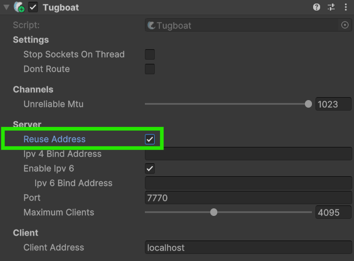
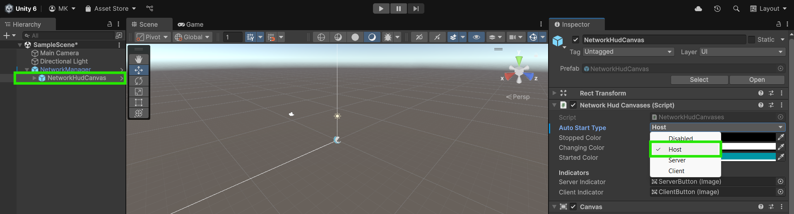
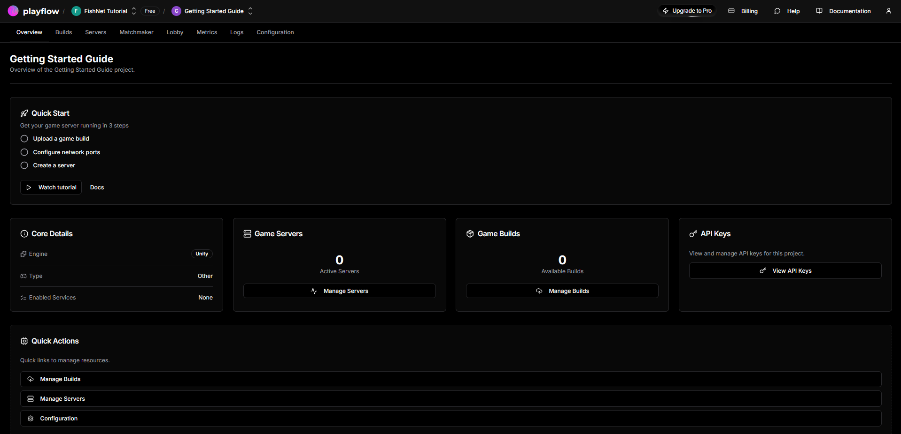
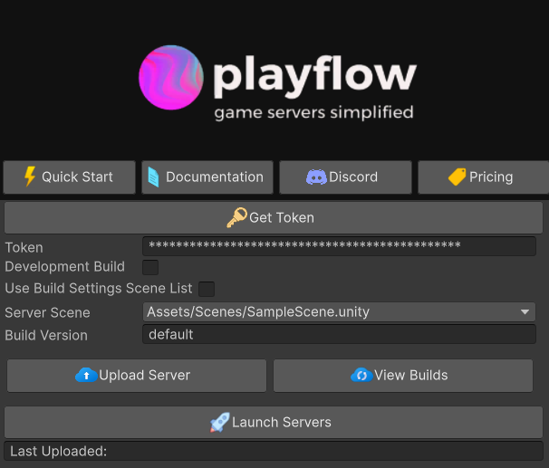
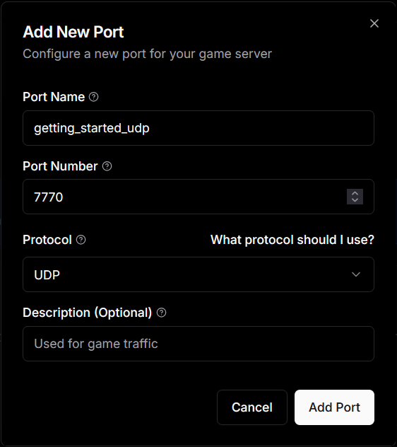
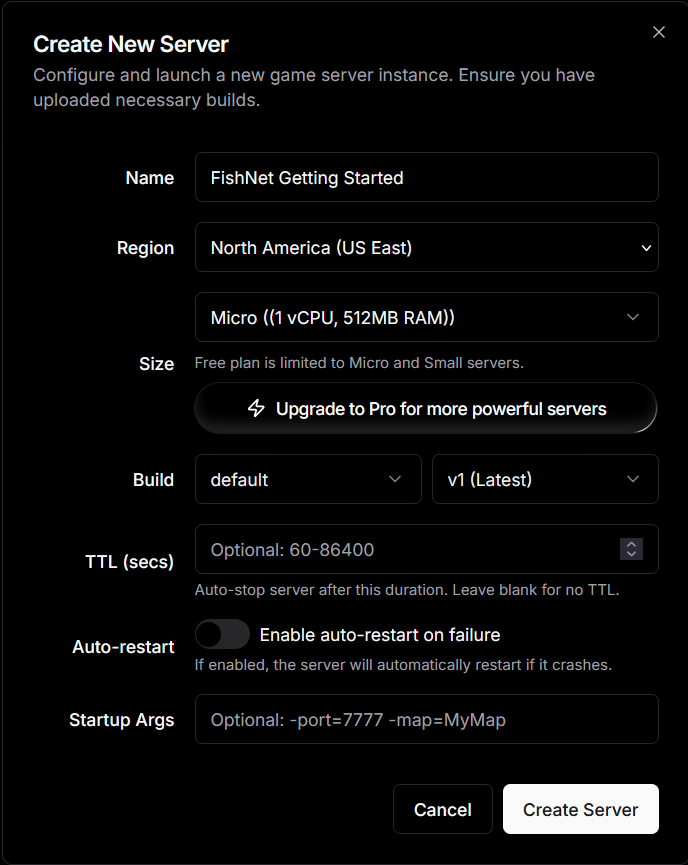
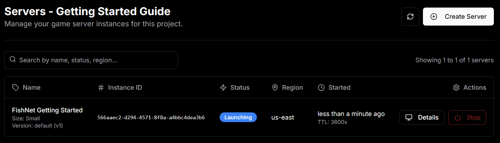
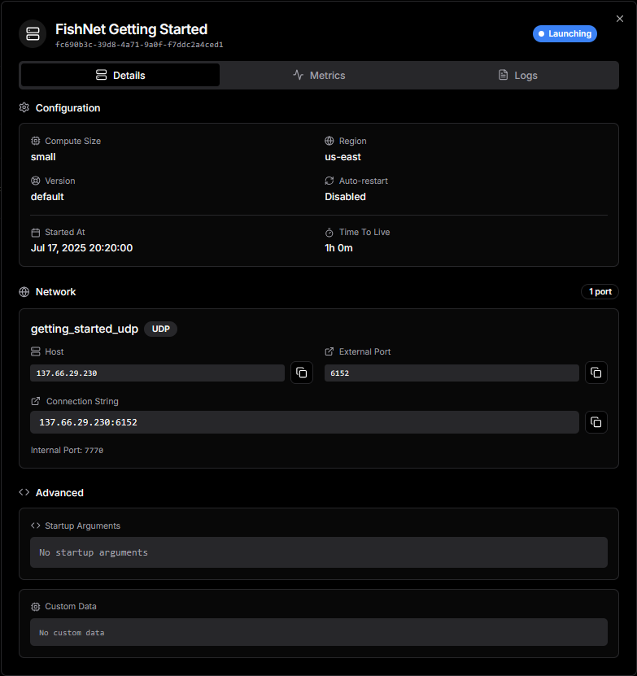

# Getting Started with PlayFlow

This guide assumes you have some or all of your game already written using FishNet and are now ready to use PlayFlow to implement a dedicated server. You can also use PlayFlow throughout the development process as its one-click deployment makes it easy to setup a temporary server for testing.

## Before We Begin...



### Starting Project

If you don't have a project already setup but want to follow this tutorial, you can use the [getting-started](../../../../tutorials/getting-started/ "mention") FishNet tutorial project. The files for it can be downloaded here:

<a href="https://github.com/maxkratt/fish-networking-getting-started/releases/download/using-syncvars-to-sync-colors/using-syncvars-to-sync-colors.unitypackage" class="button primary" data-icon="down-to-line">Getting Started Project</a>&#x20;



### Install the PlayFlow SDK

Now that we're ready to start, let's install [PlayFlow Cloud](https://www.playflowcloud.com/). You can directly import it with the following git URL:

```url
https://github.com/PlayFlowCloud/PlayFlow-Multiplayer-Unity-SDK.git
```

Simply add this through the Unity Package Manager and you'll be ready to continue!


If you need more detailed instructions for this step, check out **PlayFlow's** own tutorial page dedicated to it here.

<a href="https://documentation.playflowcloud.com/guides/installation" class="button secondary" data-icon="rocket">Installation Guide</a>




### Add the Necessary Unity Modules

The next thing we need to do is ensure our Unity installation has the correct modules for building a server. Install the **Linux Build Support** modules for your Unity version in the Unity Hub.


Exact details on the required modules depending on your Unity version can be found here:

<a href="https://documentation.playflowcloud.com/guides/unity-modules" class="button secondary" data-icon="unity">Unity Modules Setup</a>




### Add Tugboat

Select the [NetworkManager](../../../../fishnet-building-blocks/components/managers/network-manager.md) in your project and add the [Tugboat](../../../../fishnet-building-blocks/transports/tugboat.md) component if it isn't already there (If you are using a different [transport](../../../../fishnet-building-blocks/transports/), that is also fine).

Enable the **Reuse Address** checkbox, this will be needed for our server to work correctly.&#x20;

<div align="center"><figure><figcaption></figcaption></figure></div>

The other two fields we'll be paying attention to are the _Port_ and _Client Address_ ones. For now you can leave the default settings, we'll remember the port number for later and we'll use the _Client Address_ field in our client build to input the URL of our hosted server.



### Manage Auto Start

We will want FishNet to automatically start as a server in the server build we make. FishNet will actually do this by default with the [#start-on-headless](../../../../fishnet-building-blocks/components/managers/server-manager.md#start-on-headless "mention") option on the [ServerManager](../../../../fishnet-building-blocks/components/managers/server-manager.md). If you disabled this, be sure to manage starting the server itself, or simply re-enable it.

If we have set the [networkhudcanvas.md](../../../../fishnet-building-blocks/prefabs/networkhudcanvas.md "mention") _Auto Start Type_ to something other than **Disabled**, then we will want to disable it now, since we want our server to only behave as a server.

<figure><figcaption><p>Switch Auto Start Type to Disabled</p></figcaption></figure>



Once that's all done we can move on to using PlayFlow Cloud!

## Deploying Your Game With PlayFlow



### Create your PlayFlow account

Now that PlayFlow is installed, let's go to the website and setup our dashboard.

Go to the [PlayFlow Cloud website](https://app.playflowcloud.com/) and sign-up using your email, or log in with your GitHub or Google account. If asked, confirm your email address to complete the setup.



### Create a Game Studio

You'll now be prompted to create a Game Studio. Game Studios make it easy to organize your game projects and work smoothly with your team.

Enter a name for studio and select either the **Hobby** or **Pro** plan, you can read more about the plan types [here](https://documentation.playflowcloud.com/fundamentals/plan-instance-types). For this tutorial we will be using the **Hobby** plan, but don't worry, you can always change the plan and even the name after it's created.&#x20;

Once you've done that, click **Create Studio** and you'll be good to continue.


If you've chosen the **Pro** plan, you will also be able to manage **Team Collaboration** after your studio is created.




### Create a New Project

Now that you've created your first Studio you'll be prompted to choose it and then we can move forward with creating a new project.

Click the **Create New Project** button and let's enter the details of your project.

* [x] **Project Name:** give your project any fitting name you'd like.
* [x] **Game Engine:** Select <i class="fa-unity">:unity:</i> _**Unity**_ as the **Game Engine** as that's what we are usin&#x67;**.**
* [x] **Game Type:** You can choose the game type that fits your project best, for this guide we'll simply choose <i class="fa-puzzle-piece-simple">:puzzle-piece-simple:</i> _**Other.**_

You can now click **Create Project** to proceed,



### Explore the Dashboard

With your new project created and selected, you can check out the **PlayFlow** dashboard for it.

PlayFlow has a lot of powerful features and makes it very easy for you, the developer of your game, to view the logs, metrics, server details and more. The PlayFlow dashboard can also be used to directly upload your game's server builds and manage server instances.

<figure><figcaption></figcaption></figure>

Once you're done looking around, we'll jump into setting up our server build and running it.



### Link the PlayFlow SDK to your Project

Now let's link our Unity Project to the PlayFlow one we've just created.&#x20;

1. Open the **Overview** page in the PlayFlow dashboard.
2. Find the **API Keys** section and click the **View API Keys** button. Then copy the **PlayFlow API Key** to your clipboard.
3. Now go to the Unity Editor and open the PlayFlow window from the Toolbar at **PlayFlow → PlayFlow Cloud**.
4. Inside the _Token_ field, paste the **PlayFlow API Key** you copied.

<figure><figcaption></figcaption></figure>



### Build and Upload the Server

You can now customize the other settings in the PlayFlow Cloud window, such as the Development Build or Server Scene.

When you're happy with those, you can press the **Upload Server** button to have PlayFlow automatically build and upload a headless Linux server build of your game. This will take a brief moment, and then you will have a log in the editor console saying the build uploaded successfully.&#x20;

If needed, you can browse the files of the build and delete it directly from the PlayFlow Dashboard under the Builds tab; pressing the **View Builds** button in the PlayFlow window will open this directly for you.



### Setup the PlayFlow Port

Now we will setup the port to use in the PlayFlow dashboard. Open up the website and head to the **Configuration** tab and then **Network Ports** section. Click the **Add Your First Port** button and fill in the fields.

<figure><figcaption></figcaption></figure>

* [x] **Port Name:** We can enter a simple name for it here, we'll just call ours `getting_started_udp`.
* [x] **Port Number:** This field should be filled in with the port we have entered in our Transport's _Port_ field. Since we are using Tugboat, the default is `7770`, so enter that now.
* [x] **Protocol:** This is the protocol used by your transport, Tugboat uses UDP, so leave that as the option.
* [x] **Description (Optional):** This field is optional and self-explanatory.

Once those are entered, click the **Add Port** button to finish this step.



### Create the Server

Now we are ready to start our server, head over to the Servers tab and click the **Create Your First Server** button.

<figure><figcaption></figcaption></figure>

A window will pop-up letting you customize the settings for this server, we've changed the **Name** to `FishNet Getting Started`, you can of course choose any name you like as well as customizing the other settings to better suit your needs. Once you are happy, press **Create** Server.

You should now see the server in the Servers tab and you can see its details or stop it directly from here.

<figure><figcaption></figcaption></figure>



### Connect to the Server

Click on the **Details** button to see the details of the server. You can view the Details, Metrics, and Logs of the server here; we will look at the **Details → Network** section and copy the _Host_ and the _External Port_ fields.

<figure><figcaption></figcaption></figure>

In the Unity Editor, select the Tugboat component (or other transport you may be using).

* [x] Enter the IP Address you copied from the **Host** field into the Transport's _Client Address_ field.
* [x] Enter the P**ort** you copied into the Transport's _Port_ field.



### Test the Game

You can now run the game or build and run it and connect as a client. Your game should connect to the PlayFlow server we setup and work correctly!



### Take the Next Steps! <a href="#next-steps" id="next-steps"></a>

Well done! You've now learned how to setup and deploy your server using PlayFlow. If you want to check out more of their features you can checkout their documentation here: [https://documentation.playflowcloud.com/](https://documentation.playflowcloud.com/)

You are also encouraged to join their <i class="fa-discord">:discord:</i> Discord server here: [https://discord.gg/P5w45Vx5Q8](https://discord.gg/P5w45Vx5Q8)


