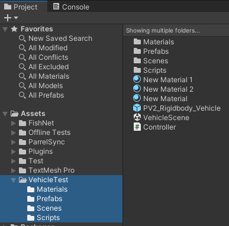

# Creating Bug Reports


Important: a new requirement is in place when creating bug reports.

To ensure your bug report is not closed please read this documentation thoroughly before creating a bug report.


New bug reports can be created by navigating [here](https://github.com/FirstGearGames/FishNet/issues/new?assignees=\&labels=\&projects=\&template=bug_report.md\&title=). You will need to be logged into GitHub to create a bug report.

## Keep An Eye On Your Reports

If your bug report is missing information we may close it out asking you to submit a new report.

Sometimes bug reports perfectly meet our guidelines but require more information. When this happens we will notify you in the bug report of what information we need, and place a 'waiting on information' flag on the bug report.

If we do request more information and receive no response within 2 weeks the report will likely be closed to keep prioritization and order. You can still comment on closed reports; we will re-open them as needed.

## Issue Template

When creating a new issue on our GitHub you will be presented with a template. Provided below is detail information on how to complete the template.

### Necessary Information

When filling out your report please include the following:

* Unity version.
* Fish-Networking version.


Since V4 is now in long-term-support we will only review bug reports on the latest Fish-Networking version.


* Steps you took to troubleshot the issue.
* An attached [sample project](./#sample-project).


If the sample project does not meet our guidelines the file will be deleted and the bug report will be closed.


Tip: Leaving your Discord name as it is in our server, or email address(less preferred) will allow us to contact you if you're unresponsive to the bug report while we still need more information.

### Description

Provide a brief description of the bug report. This should be a summary of what causes the bug or how the bug is affecting your project.

### Replication

In an ordered fashion please provide step-by-step details on how to reproduce the bug using your sample project. Be sure to indicate if starting as client, server, if multiple builds must be running, what actions to take, and so on.

### Expected Behavior

Describe what you expect the behavior to be. This helps us know if the result is intended, as well could give us insight on what may be going wrong.

### Media

If there is any media or content which could assist us in resolving your issue please provide it here. Media could be a variety of things such as images, stack traces, videos, links and more. If you are providing code samples or stacktraces please use text.

## Sample Project

A sample project should reproduce the issue in the most minimal way possible.

### Guidelines

* All samples must be within their own folder so when imported into a Unity project they will not be merged with other files. For example, MyBugReport\Scripts, MyBugReport\Prefabs, and so on.
* Provide only files needed to reproduce the problem. Do not provide extra models, prefabs, code, etc unrelated to the problem. Delete any code in provided scripts which does not directly affect your issue.
* Do not include Fish-Networking within your sample project; only include the files needed to reproduce the problem.
* Use the old input system.
* Keep the sample project **under** 1mB.
* Export as a **unitypackage.** To do so right-click your folder, Export Package, and uncheck **Include Dependencies** at the bottom.


GitHub does not allow uploading unitypackage files. You may have to archive your exported package before uploading. Please use zip format when doing so.



Model files can be large and pink materials are not fun to look at! If possible replace models with standard meshes and use the standard render pipeline.


<figure><figcaption>
Example of files found within a sample project.
</figcaption></figure>
