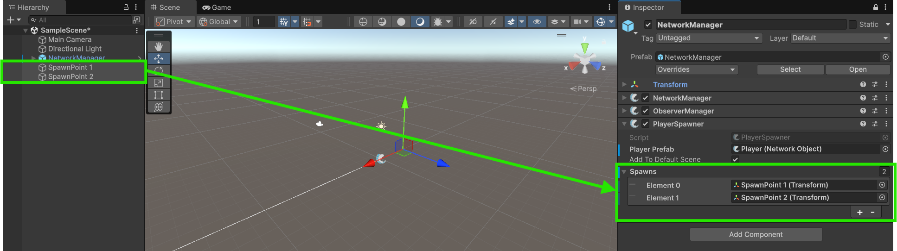

For many games you will want to have a player object for each client. This guide will walk you through the process step by step.


Before You Begin
Ensure that you're **not in Play Mode** in the Unity Editor. Making changes during Play Mode will not persist after exiting.




### Create a Player Game Object
In the Unity Scene Hierarchy, create a new 3D object of type **Capsule**.
Select the capsule in the Hierarchy and rename it to **Player**.
In the **Inspector**, click on **Add Component** and search for **NetworkObject**.
Add the **NetworkObject** component to the capsule.


The **NetworkObject** component is required for linking a game object over the network. It enables the object to synchronize its state across clients and the server.  


<figure><figcaption>
NetworkObject component added to capsule
</figcaption></figure>



### Setup the Player Object for Spawning
Drag the player game object into the project hierarchy to turn it into a prefab, then delete the game object from the scene.

<figure><figcaption>
Turn the Player Object into a Prefab
</figcaption></figure>

Select the NetworkManager in the scene and assign your new Player prefab into the **Player Prefab** field on the **PlayerSpawner** component.

<figure><figcaption>
Assign Player Prefab in Player Spawner
</figcaption></figure>



### Add Spawn Points
Create two empty Game Objects in the scene to act as spawn points. Position them where you'd like players to spawn on the map.
Add these Game Objects as **Transform** references to the **PlayerSpawner** component in the **Spawns** list field.


The **PlayerSpawner** uses these transforms to determine spawn locations, choosing them in order from top to bottom for each subsequent player and beginning again after reaching then final spawn point. If no spawn points are specified, the spawner defaults to using the prefab's transform properties for placement.


<figure><figcaption>
Create and Assign Spawn Points
</figcaption></figure>



### Test the Player Spawning
Save the scene and press the **Play** button in the Unity Editor.
As soon as the server and client starts you should see the a capsule spawning as the player object at the location of the first spawn point.
To see another player spawn you can build and run the game and which will then automatically connect as a client to the editor. You should then see a second player capsule spawn for the second player at the second spawn point.

<figure><figcaption>
Built Game Connected to Editor
</figcaption></figure>

Alternatively, you can launch a second Unity Editor instance by using [Unity's Multiplayer Play Mode](https://docs-multiplayer.unity3d.com/mppm/current/about/) package or a third party package such as [ParrelSync](https://github.com/VeriorPies/ParrelSync?tab=readme-ov-file#parrelsync).

<figure><figcaption>
Multiplayer Play Mode Connected to Editor
</figcaption></figure>


Don't worry if you encounter an error in a second game window stating: **"Server failed to start. This usually occurs when the specified port is unavailable, be it closed or already in use."** This occurs because multiple game instances are attempting to start as a server on the same machine using the same port. Only the first instance will successfully start as a server and the rest will instead start as clients only, thus this error is safe to ignore for local testing.



