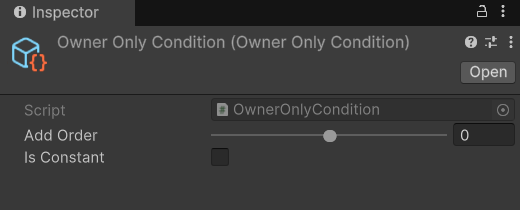

# Using Ownership To Read Values


This guide requires Share Ids to be enabled on the ServerManager for clients to read values. Share Ids is enabled by default, and does not reveal any sensitive information to clients.


We are going to demonstrate how to assign a display name to each client, and display that name on player objects.


This guide assumes you already have a NetworkManager object in your scene.


## PlayerNames

First make a new script on an empty scene object and name it PlayerNames; this script needs to inherit NetworkBehaviour.

After adding the script to your scene object a NetworkObject component will automatically be added to the same object.  On the NetworkObject enable 'Is Global', make this object a prefab, then delete it from your scene.

<figure><figcaption></figcaption></figure>


Notice that on the NetworkObject we also set the Initialize Order to -128. Doing so ensures that this NetworkObject will initialize before any other object does, which promises the OnStart callbacks will execute before other scripts. This step is most likely not needed, but given this is more-or-less a managing script for  player names giving it execution priority is good practice.


We are now going to populate the PlayerNames script with the following code.

```csharp
using System;
using FishNet.Connection;
using FishNet.Object;
using FishNet.Object.Synchronizing;
using FishNet.Transporting;
using Random = UnityEngine.Random;

public class PlayerNames : NetworkBehaviour
{
    /* Since this is a syncType it will automatically be synchronized to clients
     * whenever it updates, and when clients spawn this object! */
    
    /// <summary>
    /// Called when a player name is updated.
    /// </summary>
    public event Action<NetworkConnection, string> OnPlayerNameChanged;
    
    /// <summary>
    /// Names of all connected clients.
    /// </summary>
    public readonly SyncDictionary<NetworkConnection, string> Names = new();

    private void Awake()
    {
        Names.OnChange += NamesOnOnChange;
    }

    public override void OnStartNetwork()
    {
        //Register this to the NetworkManager so it can be found easily by any script!
        base.NetworkManager.RegisterInstance(this);
    }

    public override void OnStartServer()
    {
        base.ServerManager.OnRemoteConnectionState += ServerManagerOnOnRemoteConnectionState;
    }

    public override void OnStopServer() 
    {
        base.ServerManager.OnRemoteConnectionState -= ServerManagerOnOnRemoteConnectionState;
    }

    public override void OnStopNetwork()
    {
        //Unregister to clean up.
        if (base.NetworkManager != null)
            base.NetworkManager.UnregisterInstance<PlayerNames>();
    }

    private void ServerManagerOnOnRemoteConnectionState(NetworkConnection conn, RemoteConnectionStateArgs args)
    {
        //If disconnecting remove from the dictionary.
        if (args.ConnectionState == RemoteConnectionState.Stopped) 
        {
            Names.Remove(conn);
        }
        //If connecting then add.
        else if (args.ConnectionState == RemoteConnectionState.Started)
        {
            /* When a player connects assign them a random number
             * as their name. */
            
            //Another cog in the machine.
            string randomName = Random.Range(1000, 999999).ToString();
            Names.Add(conn, randomName);
        }
    }
    
    /// <summary>
    /// Calls whenever the _names collection updates.
    /// </summary>
    private void NamesOnOnChange(SyncDictionaryOperation op, NetworkConnection key, string value, bool asserver)
    {
        //If an add or modify then invoke.
        if (op == SyncDictionaryOperation.Add || op == SyncDictionaryOperation.Set)
            OnPlayerNameChanged?.Invoke(key, value);
    }
    
    /// <summary>
    /// Allows a client to call this RPC, updating their name.
    /// </summary>
    [ServerRpc(RequireOwnership = false)]
    public void ServerSetName(string newName, NetworkConnection caller = null)
    {
        //Caller will never be null; the server will assign it automatically when a client calls this since RequireOwnership is false.
        // ReSharper disable once AssignNullToNotNullAttribute
        Names[caller] = newName;
    }
}

```

The above code snippet will give players a random name when they connect, and allow clients to change their name by calling the SetName RPC.

## Automatically Spawning PlayerNames

After you have made the prefab select your scene NetworkManager, make a child object named ServerSpawner, and add the script ServerSpawner. You may place this script anywhere in your scene or game, but for simplicity sake we're going to nest it beneath the NetworkManager. After you add the script, insert your newly created PlayerNames prefab into the 'Network Objects' field and ensure Automatically Spawn is enabled.

<figure><figcaption></figcaption></figure>

## Displaying Player Names

Next we are going to make a very simple script which changes the text value on a TextMeshPro component. This is a very simple example which might go on the players character. You could use similar scripts for chat names, and more.

Make a new script named CharacterName. Add the following:

```csharp
using FishNet.Connection;
using FishNet.Object;
using TMPro;
using UnityEngine;

public class CharacterName : NetworkBehaviour
{

    /// <summary>
    /// Text box used to display the name of this character.
    /// </summary>
    [Tooltip("Text box used to display the name of this character.")]
    [SerializeField]
    private TextMeshProUGUI _text;

    //Cached value for unsubscribing to save a little perf.
    private PlayerNames _playerNames;
    
    public override void OnStartClient() 
    {
        //If owner is not set then do not get the name, as this does not belong to a client.
        if (!base.Owner.IsValid)
            return;
        
        //Get the PlayerNames instance to read this characters name(the player name).
        _playerNames = base.NetworkManager.GetInstance<PlayerNames>();

        //If cannot be found exit method; this shouldn't ever happen.
        if (!_playerNames.Names.TryGetValue(base.Owner, out string theName))
            return;

        _text.text = theName;

        //Also listen for updates for
        _playerNames.OnPlayerNameChanged += PlayerNamesOnOnPlayerNameChanged;
    }
    
    public override void OnStopClient() 
    {
        //Unsubscribe from events to clean up.
        if (_playerNames != null)
            _playerNames.OnPlayerNameChanged -= PlayerNamesOnOnPlayerNameChanged;
    }
    
    
    /// <summary>
    /// Called when a player name changes after initially being set, or when added for the first time.
    /// </summary>
    private void PlayerNamesOnOnPlayerNameChanged(NetworkConnection conn, string theName)
    {
        //If the name being changed is not for this owner then do not update anything.
        if (conn != base.Owner)
            return;

        //Set new name.
        _text.text = theName;
    }

}
```

Now when an object spawns containing the script above, the \_text field will be updated to the owners player name. In addition, if the owner changes their name at any time, the text will be updated again.


Notice how we make use of NetworkManager.Register, Unregister, and GetInstance in this guide. This is a very useful feature for accessing global networked scripts.

