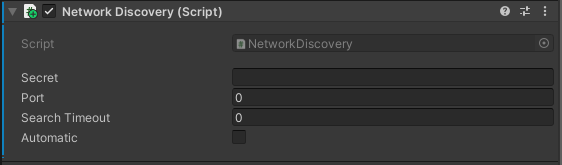

# Fish-Network-Discovery

## General

Fish-Networking-Discovery allows you to find and connect to devices on the same network without needing to adjust firewall or router rules

***

## Compatibility

<table data-full-width="false"><thead><tr><th width="149">System</th><th width="198">Supported?</th></tr></thead><tbody><tr><td>Windows</td><td><mark style="color:green;">Fully Supported</mark></td></tr><tr><td>MacOS</td><td><mark style="color:green;">Fully Supported</mark></td></tr><tr><td>IOS</td><td><mark style="color:green;">Fully Supported</mark></td></tr><tr><td>Android</td><td><mark style="color:green;">Fully Supported</mark></td></tr><tr><td>Linux</td><td><mark style="color:green;">Fully Supported</mark></td></tr><tr><td>Xbox</td><td><mark style="color:red;">Not Supported</mark></td></tr><tr><td>Playstation</td><td><mark style="color:red;">Not Supported</mark></td></tr><tr><td>Nintendo</td><td><mark style="color:red;">Not Supported</mark></td></tr></tbody></table>

***

## How to Install

For installation and usage instructions please visit the GitHub page.

Main: [https://github.com/Abdelfattah-Radwan/Fish-Networking-Discovery](https://github.com/Abdelfattah-Radwan/Fish-Networking-Discovery)

Fork: [https://github.com/FirstGearGames/Fish-Networking-Discovery/](https://github.com/FirstGearGames/Fish-Networking-Discovery/)

***

## Component Settings

<figure><figcaption>
Default Fish Network Discovery
</figcaption></figure>

* **Secret:** Secret Message to use when advertising or searching for servers
* **Port:** Port to use when advertising or searching for servers
* **Search Timeout:** How long (in seconds) to wait for a response when advertising or searching for servers
* **Automatic:** If true, will automatically start advertising or searching for servers when the NetworkManager starts or stops.
