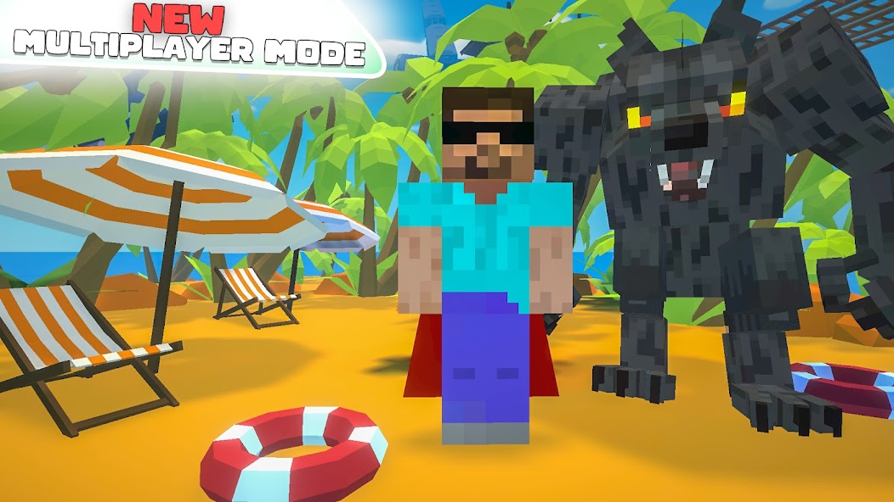
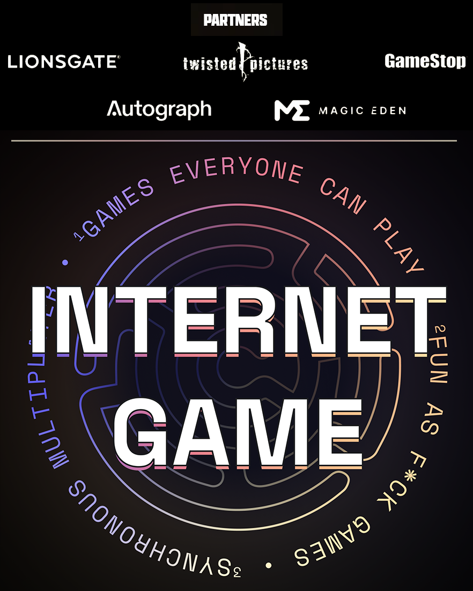

# Showcase

## Schedule 1

You're a small-time drug dealer rolling into a fresh town with no cash, no product and no connections. Build your drug empire from the ground up in the grungy west-coast city of Hyland Point. Contend against intensifying law enforcement and deadly cartel competitors to expand your empire and reach the peak of the underworld.





***

## Moorhuhn Kart 4

The world's craziest chicken is heading back to the racetrack! Wacky characters, cool tracks and karts, and zany items await in a worldwide online battle for first place!





## Potion Shop Simulator

Master the art of alchemy in Potion Shop Simulator, a unique blend of simulation and strategy. Brew potions, manage your shop, and cater to a magical clientele in a single-player or co-op experience of the medieval fantasy world.





***

## Hellcome

SURVIVE TOGETHER! Hellcome is a top-down 4 multiplayer zombie survival party game. Enjoy a healthy selection of levels, characters, weapons, upgrades and more.\\





***

## Arcade Sundown

Arcade Sundown is a new type of sports game that combines pinball mechanics with the ridiculous spectacle that is bubble soccer. The gameplay is fast-paced, offensive, and chaotic in a way that is quickly hilarious – for players and spectators alike.





***

## FAS: Fight Action Sandbox

FAS is a unique turn-based fighting game where you design your characters and their abilities. Fight against AI or friends!





***

## Golfie

Golfie is a run-based, roguelike minigolf deck builder. Play through procedurally-generated levels, build a deck of crazy card abilities, and try to beat all 18 holes.





***

## Cat Warfare

What's more chaotic than a cat, with a rocket launcher? Play through the eyes of a weaponized feline in this Quake-like first person shooter.





***

## Extreme Tag!

**Extreme Tag!** is a casual party game for all! Run from tagged players to stay alive. Last one standing wins!





***

## Guns, Blocks, and Steel

A tactical multiplayer FPS created by a solo developer as a passion project. Featuring a fully destructible, block-based environment. Gather resources to produce weapons, ammo, and vehicles. Play multiplayer PVP/co-op or singleplayer with bots.





***

## Marble Smashers

Marble Smashers is a 3D fighting game for 2-4 players where the goal is to knock out your opponents off the stage and be the last one standing. Do what you must with your limited moveset and stage objects to ensure your victory!





## Chess For Idiots

The first intellectually non-discriminatory chess variant. Instead of thinking, just move your pieces in one of the many absurd ways!





***

## Snow Folks

Discover the magic of a winter wonderland with Snow Folks! You can build snow forts, houses and anything you can imagine. Get creative with your friends, build your own castle, have the ultimate snowball fight, or play solo and create your own snow day adventure!

<figure><figcaption></figcaption></figure>



***

## Meow Meow Wizard Arena

Meow Meow Wizard Arena brings a fun game with excellent feeling controls to mobile. In this game of cats you get to practice magic, and fight other cats, for no other reason than being a cat. Choose from beautiful outfits or create your own costumes! Breed your powerful cats to create even more powerful offspring.





***

## One Up

The goal is simple, try to reach the top, _try_ being the operative word. Test your agility as a werewolf, a cow, or a strikingly hansom man wearing a cape. With over 500,000 downloads you'll have a hard time putting this one down.

<figure><figcaption></figcaption></figure>



***

## LOCOSOCCER

LOCOSOCCER is a crazy fast-paced physics-based casual football game that you can play everywhere with anybody or against anybody.





***

## Internet.Game: SAW

Competitive games relying on Fish-Networking's tick system and server authoritative abilities. Internet.Game introduces high-value puzzle and skill-based games with cash prizes.

Partnered with big names LIONSGATE, Twisted Pictures, GameStop, Authograph, and Magic Eden.

[https://internet.game](https://internet.game)

<figure><figcaption></figcaption></figure>

***

## Valkyrie Champions

Valkyrie Champions is a mission-based Hero Shooter with an emphasis on upgrades and progression. Choose your champion and fight solo or with up to 4 online friends against huge amounts of enemies and ultimately save the lands against evil!

Each champion has unique abilities and stats which can be customized with equipment, power-ups, and talent trees.


Valkyrie Champions Trailer.




***

## Arcadius

The Arcadius development team made a decision to switch to Fish-Networking after experiencing server crashes and costly server fees on Mirror networking. After switching to Fish-Networking the Arcadius team was able to increase their CCU limit from 40 to 500 without any problems, and are now saving over 75% in server fees.


Arcadius Trailer




***

## Plethora

Plethora is a MMO made with Fish-Networking, utilizing our built-in client-side prediction system. Within Plethora players can compete in hypercasual mini-games, with the potential to win valueable NTFs and minting rights from other NFT projects. Plethora offers bi-weekly competitions, leaderboards, and even daily quests for regular players.

[https://plethora.game/](https://plethora.game/)

