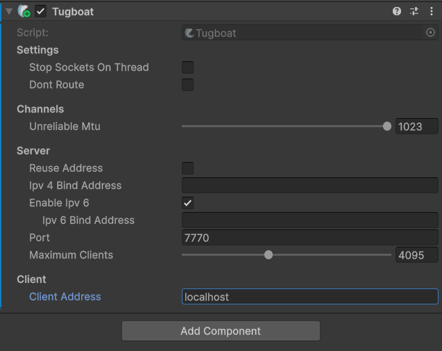

# Connecting to Remote Devices

Once you have a basic networked game set up and can connect as a host, the next crucial step for true multiplayer is enabling clients to connect to a server running on a different machine. This guide will walk you through the process of connecting to remote devices.



### **Identifying the server's IP address**

For a client to connect to a remote server, it needs to know the server's IP address.

* **Local Network (LAN):** If the server and client are on the same local network (e.g., two computers in the same house), you'll need the server machine's local IP address (e.g., `192.168.1.100`). You can usually find this through your operating system's network settings.
* **Public Network (Internet):** If clients are connecting over the internet, you'll need the server's public IP address. This is often the IP address of the router that the server machine is connected to. You might need to set up **port forwarding** on the server's router to allow incoming connections to the game server's port.


For testing on a local network, you can often find your machine's IP address by opening a command prompt (Windows) and typing `ipconfig`, or a terminal (macOS/Linux) and typing `ifconfig` or `ip a`. Look for the IPv4 address associated with your active network adapter.




### **Configuring the client to connect**

To connect as a client to a remote server, you'll need to manually set the server's address.

1. **Locate the NetworkManager:** In your Unity scene, select the **NetworkManager** game object.
2. **Select or add the Transport Component:** In the Inspector, locate the [Transport](../../guides/high-level-overview/transports.md) component (e.g., [Tugboat](../../fishnet-building-blocks/transports/tugboat.md) if you're using the default). If there is none, add Tugboat now.
3. **Set the Address:** Find the `Client Address` field within the Transport component. Enter the IP address of your remote server here. For example, if your server's local IP is `192.168.1.100`, you would enter that.
4. **Set the Port (if different):** The default port for FishNet is `7777`. If your server is configured to use a different port, update the `Port` field accordingly.


The `NetworkHudCanvas` is a convenient debugging tool. In a finished game, you would typically create your own UI for players to enter an IP address and connect.


<figure><figcaption></figcaption></figure>



### **Building and testing the connection**

To test connecting to a remote device, you'll need to build your game.

1. **Build the Client:** Go to `File > Build Settings...`. Ensure your scene is added to "Scenes In Build". Select your target platform (e.g., Windows, macOS, Android). Click `Build` and choose a location to save your executable.
2. **Start the Server:** Launch one instance of your game (either from the Unity Editor, a regular build or a dedicated server build) on the machine that will act as the server. If it's a dedicated server build then the FishNet server will start automatically, otherwise you will need to make sure you start it with the NetworkHudCanvas Server button, Autostart option, or through your own code.
3. **Launch the Client:** On a _separate_ machine, launch the client build you just created.
4. **Connect:** If you disabled auto-start, click the "Start Client" button from the NetworkHudCanvas in the client build.

If configured correctly, the client should connect to the server, and you should see network-related messages in both the server and client consoles indicating a successful connection. You should also see players spawning as configured in the [preparing-your-player.md](preparing-your-player.md "mention") guide.



### **Troubleshooting common connection issues**

If your client fails to connect, consider these common issues:

* **Incorrect IP Address:** Double-check that the IP address entered in the Transport component is correct for the server machine. Also make sure you entered it in the "Client Address" field and not one of the "Server Bind Address" fields.
* **Firewall:** Ensure that the firewall on the server machine is not blocking incoming connections on the game's port (default 7777). You may need to create an inbound rule to allow traffic.
* **Port Forwarding (for Internet connections):** If connecting over the internet, the server's router needs to be configured to forward the game's port (e.g., 7777) to the server machine's local IP address. Without this, external clients cannot reach your server.
* **Server Not Running:** Verify that the server instance of your game is actually running and has successfully started its network services.
* **Different Game Versions:** Ensure both the server and client are running the exact same version of your game build. Mismatched versions can cause connection failures.
* **Network Congestion/Latency:** On public networks, high latency or packet loss can sometimes lead to connection timeouts.

By carefully checking these points, you can resolve most connection issues and get your remote clients connected.


If you are trying to test over the Internet, it may be easier and safer to use an application to create a virtual LAN instead of portforwarding your router.



