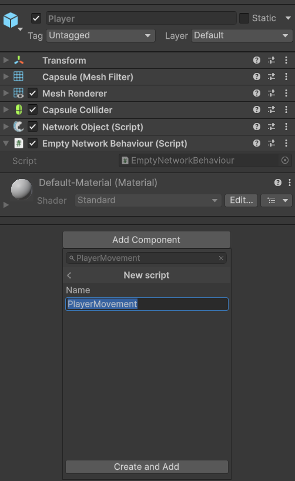
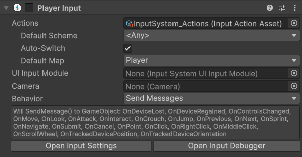
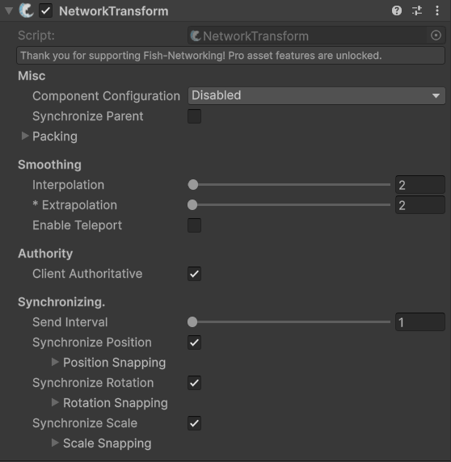
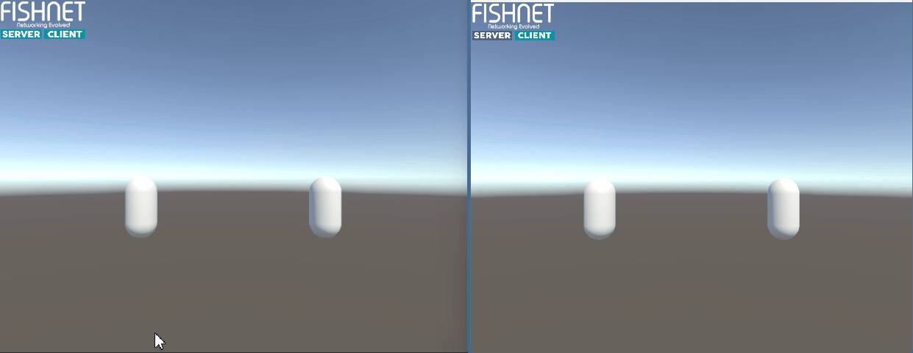

# Moving Your Player Around

Now that your player object is properly spawned and prepared, it's time to get it moving. In this section, we'll implement a simple client-authoritative movement script and utilize FishNet's [NetworkTransform ](../../fishnet-building-blocks/components/network-transform.md)component to effortlessly synchronize that movement across all connected devices.

#### Client-authoritative movement script

For many games, particularly those with real-time player input, client-authoritative movement is the most straightforward approach. This means the client directly controls its own player object and then informs the server (and other clients) about its position and rotation.


Client-authoritative movement makes it easier for the client to cheat with speed hacks, teleportation, and other movement related hacks, but it is a lot easier to implement and understand.




### **Creating a player movement script**

Select your **Player** prefab in the Project window. In the Inspector, click on **Add Component** and search for **New Script**. Name the script `PlayerMovement` and click **Create and Add**.

<figure><figcaption><p>Creating the PlayerMovement script</p></figcaption></figure>



### **Editing the script**

Double-click the `PlayerMovement` script to open it in your code editor. Replace the default code with the following:



Unlike typical single-player scripts that use `MonoBehaviour`, this script inherits from `NetworkBehaviour`. This allows for direct access to the `IsOwner` field. Although you could still check ownership via the [NetworkObject](../../fishnet-building-blocks/components/network-object.md) component on a **MonoBehaviour**, [NetworkBehaviour](../../guides/features/networked-gameobjects-and-scripts/network-behaviour-guides.md) provides significant advantages. It enables [RPCs](../../guides/features/network-communication/remote-procedure-calls.md), [SyncVars](../../guides/features/network-communication/synchronizing/), and [specialized override methods](../../guides/features/networked-gameobjects-and-scripts/network-behaviour-guides.md#callbacks) (akin to Unity's `Start`, `Awake`, and `OnDestroy` but for networked objects).


```csharp
using FishNet.Object;
using UnityEngine;

// Inherit from NetworkBehaviour instead of MonoBehaviour
public class PlayerMovement : NetworkBehaviour
{
    public float MoveSpeed = 5f;

    private void Update()
    {
        // Only run this code on the object the local client owns.
        // This prevents us from moving other players' objects.
        if (!IsOwner)
            return;

        float horizontal = Input.GetAxis("Horizontal");
        float vertical = Input.GetAxis("Vertical");

        Vector3 moveDirection = new Vector3(horizontal, 0f, vertical);
        if (moveDirection.magnitude > 1f)
            moveDirection.Normalize();

        transform.position += MoveSpeed * Time.deltaTime * moveDirection;
    }
}
```


Since there will be multiple player game objects in the game, we need to determine which one is "our" local player's one and only move that with our input. The `IsOwner` guard clause handles this.



If using [Unity's New Input System](https://learn.unity.com/tutorial/setting-up-the-input-system-u6?uv=6), you should add the **Player Input** component to your **Player Prefab** and be sure to **disable** it

<figure><figcaption><p>The PlayerInput component added to the Player Prefab and Disabled</p></figcaption></figure>

Unlike typical single-player scripts that use `MonoBehaviour`, this script inherits from `NetworkBehaviour`. This allows for direct access to the `IsOwner` field. Although you could still check ownership via the [NetworkObject](../../fishnet-building-blocks/components/network-object.md) component on a **MonoBehaviour**, [NetworkBehaviour](../../guides/features/networked-gameobjects-and-scripts/network-behaviour-guides.md) provides significant advantages. It enables [RPCs](../../guides/features/network-communication/remote-procedure-calls.md), [SyncVars](../../guides/features/network-communication/synchronizing/), and [specialized override methods](../../guides/features/networked-gameobjects-and-scripts/network-behaviour-guides.md#callbacks) (akin to Unity's `Start`, `Awake`, and `OnDestroy` but for networked objects).


```csharp
using FishNet.Object;
using UnityEngine;
using UnityEngine.InputSystem;

// Inherit from NetworkBehaviour instead of MonoBehaviour
public class PlayerMovement : NetworkBehaviour
{
    public float MoveSpeed = 5f;
    private Vector2 _currentMovementInput;

    public override void OnStartClient()
    {
        if (IsOwner)
            GetComponent<PlayerInput>().enabled = true;
    }

    public void OnMove(InputValue value)
    {
        _currentMovementInput = value.Get<Vector2>();
    }

    public void Update()
    {
        // Only run this code on the object the local client owns.
        // This prevents us from moving other players' objects.
        if (!IsOwner)
            return;

        Vector3 moveDirection = new Vector3(_currentMovementInput.x, 0f, _currentMovementInput.y);
        if (moveDirection.magnitude > 1f)
            moveDirection.Normalize();

        transform.position += MoveSpeed * Time.deltaTime * moveDirection;
    }
}
```


Since there will be multiple player game objects in the game, we need to determine which one is "our" local player's one and only move that with our input. The `IsOwner` guard clause in `Update` handles this. We are also using the NetworkBehaviour `OnStartClient` callback to enable the **PlayerInput** component when `IsOwner` is true. This method runs when the network object is initialized on the network and only on the client side. It's similar to Unity's `Start` callback and is used here to only send the input to our local player object.

You might wonder why we can’t just use `Awake` or `Start` here, but the reason is that FishNet doesn’t always have enough time to link the object on the network and assign its owner before those methods execute.





### **Synchronizing the movement**

Now we have code that will allow clients to move only their respective player object, but nothing is yet synchronized over the network This means that we won't ever see other players moving, and they won't see us moving.

To fix this, we will use Fish-Networking's built-in [NetworkTransform](../../fishnet-building-blocks/components/network-transform.md) component. This component can be used to synchronize a network object's scale, rotation, position, and parent hierarchy.

Open your **Player Prefab** and add the **NetworkTransform** component to it.

<figure><figcaption><p>The default settings of the <strong>NetworkTransform.</strong></p></figcaption></figure>

This component has quite a few settings, but the most important ones for us right now are the **Client Authoritative** and the **Synchronize Position** fields. Both of these should be enabled, which will mean positional changes made by the owner client will automatically be synchronized to the server and then to all other clients.



### **Testing the player movement**

Save your scene and press the **Play** button in Unity's Editor. Your player capsule should now be visible. Use the **W, A, S, D** keys or arrow keys to move your player around the scene.

To test multi-player movement, you can build and run the game, which will automatically connect as a client to the editor. You should then be able to control your player in the editor, and the second instance will control its own player, seeing both players move independently.

<figure><figcaption></figcaption></figure>




Download the project files with these completed steps here, or explore the repository:

<a href="https://github.com/maxkratt/fish-networking-getting-started/releases/download/moving-your-player-around-complete/moving-your-player-around.unitypackage" class="button primary" data-icon="down-to-line">Source Files</a> <a href="https://github.com/maxkratt/fish-networking-getting-started/tree/moving-your-player-around" class="button secondary" data-icon="github">Repository</a>

