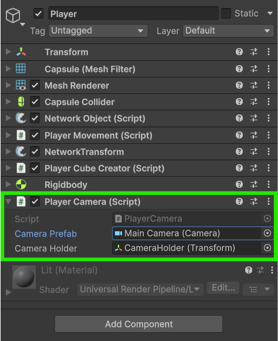

# Instantiating a Local Camera

With this method of camera management we will instantiate a camera from a prefab we create and assign it to our local player object when it spawns in.



### **Creating a camera prefab**

Let's start by dragging the **Main Camera** in the scene into our **Project Window** to create a prefab out of it. You can now delete the **Main Camera** from the **Scene Hierarchy**.



### **Giving the player a camera holder**

Now create an empty Game Object on your **Player Prefab** and position it where you'd like. This will be where we instantiate and position the **Camera** object.

<figure><figcaption><p>Camera Holder created on the player prefab</p></figcaption></figure>



### **Writing a PlayerCamera script**

Let's now add the following script to the **Player Prefab** that we will use to instantiate our **Camera Prefab** once our player spawns in.


```csharp
using FishNet.Object;
using UnityEngine;

// This script will be a NetworkBehaviour so that we can use the 
// OnStartClient override.
public class PlayerCamera : NetworkBehaviour
{
    [SerializeField] private Camera cameraPrefab;
    [SerializeField] private Transform cameraHolder;

    // This method will run on the client once this object is spawned.
    public override void OnStartClient()
    {
        // Since this will run on all clients that this object spawns for
        // we need to only instantiate the camera for the object we own.
        if (IsOwner)
            Instantiate(cameraPrefab, cameraHolder.position, cameraHolder.rotation, cameraHolder);
    }
}
```


This script uses the [OnStartClient](../../../guides/features/networked-gameobjects-and-scripts/network-behaviour-guides.md#onstartclient) override method from [NetworkBehaviour](../../../guides/features/networked-gameobjects-and-scripts/network-behaviour-guides.md) to instantiate the camera prefab for our local player.



### **Assign your references to the script**

Now select the **Player Camera** component in your **Player Prefab** and add the **Camera Prefab** we made to the _Camera Prefab_ field. Also select the **CameraHolder** game object in the _Camera Holder_ field.

<figure><figcaption><p>The player prefab with the Main Camera filled in</p></figcaption></figure>



### **Test the camera in-game**

With all that set you should be able to run the game and see how the camera is created for only your local player.

<figure><figcaption><p>Demonstration of the local camera</p></figcaption></figure>




Download the project files with these completed steps here, or explore the repository:

<a href="https://github.com/maxkratt/fish-networking-getting-started/releases/download/instantiating-a-local-camera/instantiating-a-local-camera.unitypackage" class="button primary" data-icon="down-to-line">Source Files</a> <a href="https://github.com/maxkratt/fish-networking-getting-started/tree/instantiating-a-local-camera" class="button secondary" data-icon="github">Repository</a>

