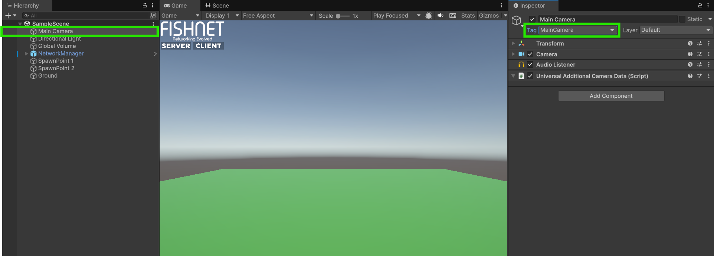
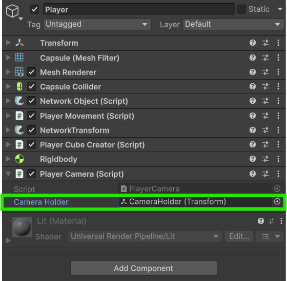

# Using the Scene Camera

With this method our local player will take control of the Main Camera it finds in the scene.



### **The main camera tag**

Before we start we need to ensure our camera object in the scene is tagged as the "Main Camera"

<figure><figcaption><p>Main Camera in scene with the tag</p></figcaption></figure>



### **Giving the player a camera holder**

Now create an empty Game Object on your **Player Prefab** and position it where you'd like. This will be where we parent and position the **Camera** object.

<figure><figcaption><p>Camera Holder created on the Player Prefab</p></figcaption></figure>



### **Writing a PlayerCamera script**

Let's now add the following `PlayerCamera` script to the **Player Prefab** that we will use to take control of our **Camera** once our player spawns in.


```csharp
using FishNet.Connection;
using FishNet.Object;
using UnityEngine;

// This script will be a NetworkBehaviour so that we can use the 
// OnOwnershipClient override.
public class PlayerCamera : NetworkBehaviour
{
    [SerializeField] private Transform _cameraHolder;

    // This method is called on the client after gaining or losing ownership of the object.
    // We could have used OnStartClient instead, as we did in the previous example, but using OnOwnershipClient
    // means this will work for a player object we don't initially own but are given ownership to later.
    public override void OnOwnershipClient(NetworkConnection prevOwner)
    {
        if (Camera.main == null)
            return;

        // If we are the new owner of this object, then take control of the camera by parenting it
        // and moving it to our camera holder.
        if (IsOwner)
        {
            Camera.main.transform.SetPositionAndRotation(_cameraHolder.position, _cameraHolder.rotation);
            Camera.main.transform.SetParent(_cameraHolder);
        }
    }
}
```


This script uses the [OnOwnershipClient](../../../guides/features/networked-gameobjects-and-scripts/network-behaviour-guides.md#onownershipclient) override method from [NetworkBehaviour](../../../guides/features/networked-gameobjects-and-scripts/network-behaviour-guides.md) to instantiate the camera prefab for our local player as soon as he gets ownership of the object. We could just have easily used the [OnStartClient](../../../guides/features/networked-gameobjects-and-scripts/network-behaviour-guides.md#onstartclient) override method like the [instantiating-a-local-camera.md](instantiating-a-local-camera.md "mention") example shows.



### **Assign your references to the script**

Now select the **Player Camera** component in your **Player Prefab** and add the **Camera Prefab** we made to the _Camera Prefab_ field. Also select the **CameraHolder** game object in the _Camera Holder_ field.

<figure><figcaption><p>The Player prefab with the <strong>Camera Holder</strong> filled in</p></figcaption></figure>



### **Test the camera in-game**

With all that set you should be able to run the game and see how the camera from the scene is controlled by only your local player.

<figure><figcaption><p>Demonstration of the local camera</p></figcaption></figure>




Download the project files with these completed steps here, or explore the repository:

<a href="https://github.com/maxkratt/fish-networking-getting-started/releases/download/using-the-scene-camera/using-the-scene-camera.unitypackage" class="button primary" data-icon="down-to-line">Source Files</a> <a href="https://github.com/maxkratt/fish-networking-getting-started/tree/scene-camera" class="button secondary" data-icon="github">Repository</a>

