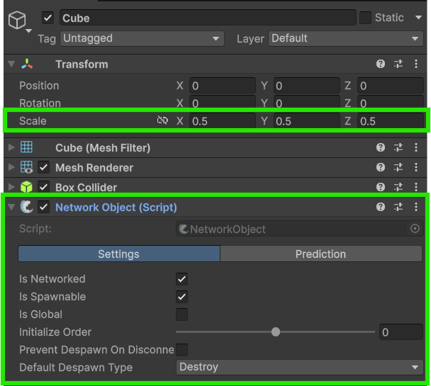
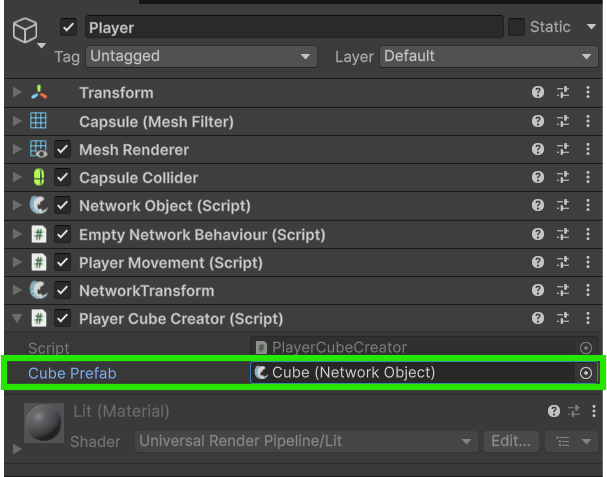
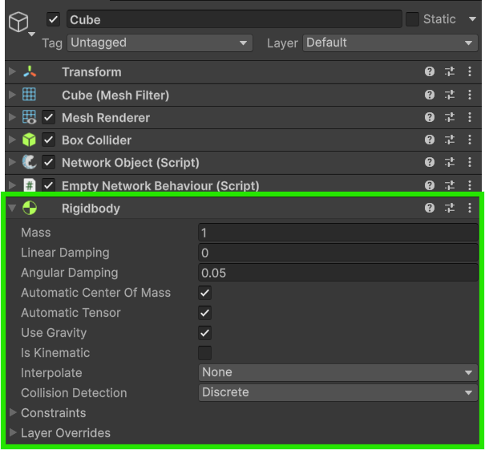
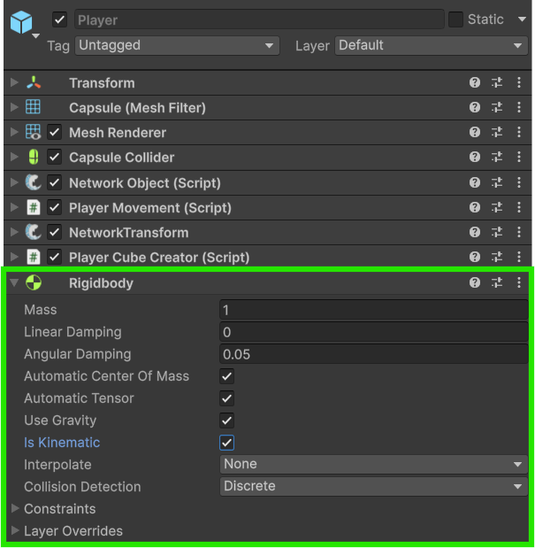
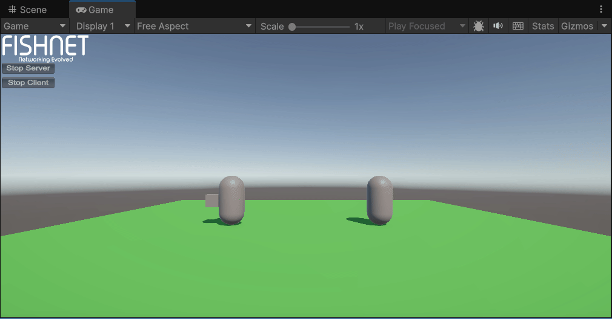
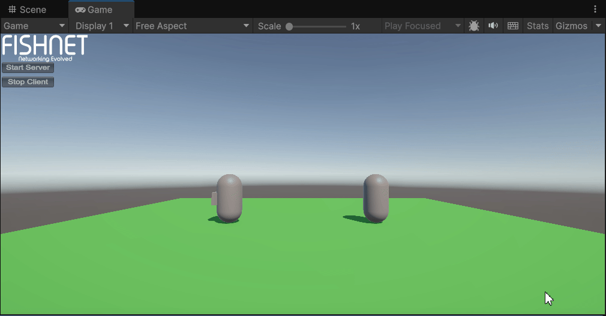

# Spawning and Despawning Items

Now that we have players moving around, let's learn how to _spawn_ and _despawn_ [NetworkObjects](../../guides/features/networked-gameobjects-and-scripts/networkobjects/).

While you can [Instantiate](https://docs.unity3d.com/ScriptReference/Object.Instantiate.html) and [Destroy](https://docs.unity3d.com/ScriptReference/Object.Destroy.html) regular Game Objects, Network Objects need to be Spawned and Despawned, this tells FishNet to synchronize the action over the network. FishNet stores all network object prefabs in a collection called the [Spawnable Prefabs](../../fishnet-building-blocks/scriptableobjects/spawnableprefabs/). You can see this and customize it on the [NetworkManager](../../fishnet-building-blocks/components/managers/network-manager.md).


We have added a large green cube to act as the floor which you can do too, but this isn't a vital step.




**Creating the Item NetworkObject Prefab**

Let's create a **Cube** in the scene hierarchy, and add a **NetworkObject** component to it. We've also decreased it's scale by half so that it doesn't look too large.\
Then drag it into the project window to turn it into a prefab; you can destroy the original game object in the scene hierarchy now.

<figure><figcaption><p>The Cube with size adjusted and NetworkObject added</p></figcaption></figure>



**Creating a Script to Spawn the Cube**

Now create a script called `PlayerCubeCreator` and add it to your **Player Prefab**. This script is going to be responsible for spawning our new cube item across the network.




```csharp
using FishNet.Object;
using UnityEngine;

public class PlayerCubeCreator : NetworkBehaviour
{
    public NetworkObject cubePrefab;

    void Update()
    {
        // Only the local player object should perform these actions.
        if (!IsOwner)
            return;

        if (Input.GetButtonDown("Fire1"))
            SpawnCube();
    }

    // We are using a ServerRpc here because the Server needs to do all network object spawning.
    [ServerRpc]
    private void SpawnCube()
    {
        NetworkObject obj = Instantiate(cubePrefab, transform.position, Quaternion.identity);
        Spawn(obj); // NetworkBehaviour shortcut for ServerManager.Spawn(obj);
    }
}

```





```csharp
using FishNet.Object;
using UnityEngine;
using UnityEngine.InputSystem;

public class PlayerCubeCreator : NetworkBehaviour
{
    public NetworkObject cubePrefab;

    public override void OnStartClient()
    {
        if (IsOwner)
            GetComponent<PlayerInput>().enabled = true;
    }

    public void OnFire(InputAction.CallbackContext context)
    {
        if (context.started)
            SpawnCube();
    }

    // We are using a ServerRpc here because the Server needs to do all network object spawning.
    [ServerRpc]
    private void SpawnCube()
    {
        NetworkObject obj = Instantiate(cubePrefab, transform.position, Quaternion.identity);
        Spawn(obj); // NetworkBehaviour shortcut for ServerManager.Spawn(obj);
    }
}
```





This may be a great time to read [this page](../../guides/features/network-communication/remote-procedure-calls.md) about RPCs[^1] such as the [ServerRpc](../../guides/features/network-communication/remote-procedure-calls.md#serverrpc) we use here.


Because this script contains a ServerRpc, it will also need to be a **NetworkBehaviour**. The `Update` method listens for the user to press the <kbd>Fire1</kbd> button (typically the left mouse button) and then calls `SpawnCube`.

**Understanding `SpawnCube`:**

* The **ServerRpc** attribute: This is crucial. It means this method is intended to be called by a client, but it will _execute only on the server_. The client sends a message to the server, requesting this method to be run.
* `Spawn(obj);`: This is the most critical line for networked objects. Calling `Spawn(obj)` on the `NetworkObject` tells FishNet's `ServerManager` to "spawn" this object over the network. This means the server will now instruct all currently connected clients (and any clients that connect later) to instantiate their own replica of this object.


You can read our more in-depth page about **Spawning** [here](spawning-and-despawning-items.md).




**Assigning the Prefab to Your Script**

Now select your **Player Prefab** and assign your **Cube Prefab** to the "Cube Prefab" field in your newly created **Player Cube Creator** script.

<figure><figcaption><p>Player Cube Creator with Cube Prefab assigned</p></figcaption></figure>


You may have noticed that an **Empty Network Behaviour** component was automatically added to your game objects with a **NetworkObject** component. This happens because each FishNet requires every NetworkObject to also have a NetworkBehaviour on it, and it will automatically add an empty one if it doesn't detect any. You can safely remove this empty component as you have added multiple other **NetworkBehaviour** components, but it's not a problem either way.




**Test If the Spawning Works**

Now launch a couple instances of your game and see if you can run around and spawn cube items by pressing the <kbd>Fire1</kbd> button. The cubes should be visible on all devices connected to each other.

<figure><figcaption><p>Player Spawning Cubes</p></figcaption></figure>



**Add Some Physics**

Static cubes are boring! Let's add a **Rigidbody** component to the **Cube Prefab** to enable basic physics interactions with them.

<figure><figcaption><p>Rigidbody added to the Cube</p></figcaption></figure>

Now the cubes should roll around and collide with the ground. Let's add a **Rigidbody** to the **Player** now and set it to **Is Kinematic**.

<figure><figcaption><p>Player with Kinematic Rigidbody added</p></figcaption></figure>



**Test If the Physics Works**

If you launch the game now, the cubes should have basics physics working.

<figure><figcaption><p>Players Spawning Physics Cubes</p></figcaption></figure>

You may notice the cubes' positions don't always sync up after they are moved around, that's because we haven't done any positional syncing besides the initial position syncing that FishNet automatically did when we called `Spawn`.


Networked Rigidbodies are a complex topic, and better suited to a different guide, but if you want to test a really basic setup up, you can add a [NetworkTransform](../../fishnet-building-blocks/components/network-transform.md) to your **Cube Prefab** and set its **Component Configuration** to **Rigidbody.**




**Script to Despawn Cubes On A Timer**

Now that we can `Spawn` cubes successfully, let's `Despawn` them after a few seconds so that we don't end up with too many objects at once.

Create a new script called `DespawnAfterTime`:


```csharp
using FishNet.Object;
using System.Collections;
using UnityEngine;

public class DespawnAfterTime : NetworkBehaviour
{
    public float secondsBeforeDespawn = 3f;

    public override void OnStartServer()
    {
        StartCoroutine(DespawnAfterSeconds());
    }

    private IEnumerator DespawnAfterSeconds()
    {
        yield return new WaitForSeconds(secondsBeforeDespawn);

        Despawn(); // NetworkBehaviour shortcut for ServerManager.Despawn(gameObject);
    }
}

```


This script uses the [OnStartServer](../../guides/features/networked-gameobjects-and-scripts/network-behaviour-guides.md#onstartserver) NetworkBehaviour override method to start a Coroutine which will `Despawn` the object. OnStartServer will run on the server when the object is initialized with the network.

`Despawn` needs to be called on the server and it will destroy the game object locally as well as on all clients automatically for you.



**Assigning the Script and Testing**

Open your **Cube Prefab** now and add the **Despawn After Time** script you just made to the object.

Launch the game again and observe the objects being Despawned successfully on the server and all clients after a few seconds.

<figure><figcaption><p>Cubes Despawning After 3 Seconds</p></figcaption></figure>




Download the project files with these completed steps here, or explore the repository:

<a href="https://github.com/maxkratt/fish-networking-getting-started/releases/download/spawning-and-despawning-items/spawning-and-despawning-items.unitypackage" class="button primary" data-icon="down-to-line">Source Files</a> <a href="https://github.com/maxkratt/fish-networking-getting-started/tree/spawning-and-despawning-items" class="button secondary" data-icon="github">Repository</a>


[^1]: Remote Procedure Calls
