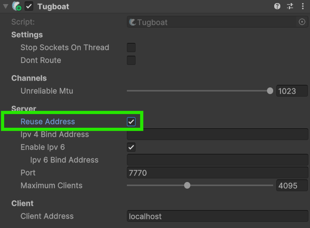

# Building a Dedicated Server

FishNet supports running your project as a **dedicated server**, meaning Unity runs without rendering graphics and focuses purely on network logic. This is the recommended way to host multiplayer games at scale. You can deploy this build to a server hosting service, your own physical servers, or even give it to your players to allow them to host their own servers for your game.


Learn more about Unity's Dedicated Server Build Profiles [here](https://docs.unity3d.com/Manual/dedicated-server-introduction.html).


***

## Required Unity modules

Before building your server, ensure you have the correct Unity modules installed. You will need the **Dedicated Server Build Support** module for your **server's** operating system. This is usually Linux, but it can be Windows or MacOS too if needed.



To install the modules through the Unity Hub:

1. Open the **Unity Hub**
2. Go to the **Installs** tab
3. Find your desired Unity version
4. Click "<i class="fa-gear">:gear:</i> **Manage**" and then **Add Modules**
5. Tick the relevant build targets
6. Click **Continue** and complete the installation.

<div data-full-width="false"><figure><figcaption><p>Needed Linux Build Module for a Dedicated Server</p></figcaption></figure></div>



To install the modules through the Unity Editor:

1. Open the Unity Editor
2. Go to **File → Build Profiles**
3. Select your server's target platform. For example **Linux Server** or **Windows Server.**
4. If the module is already installed, you will be able to switch to it, otherwise Unity will prompt you to install it.
5. Click **Install with Unity Hub** as necessary

<figure><figcaption><p>Installing a Windows Server build module</p></figcaption></figure>



***

## Ensuring FishNet's server starts

With the default settings, FishNet detects when the game is built as a dedicated server and will start the FishNet server as soon as the [NetworkManager](../../fishnet-building-blocks/components/managers/network-manager.md) is loaded. You can change this setting by adding the [ServerManager](../../fishnet-building-blocks/components/managers/server-manager.md) component to your NetworkManager and adjusting the [Start on Headless](../../fishnet-building-blocks/components/managers/server-manager.md#start-on-headless) option. You may want to do this when you are starting the server yourself, for example if you want to dynamically set a custom port or server bind address.

If you disable this functionality you may want to implement it yourself; in the script below, we use the `UNITY_SERVER` preprocessor directive to only include the server starting line of code when built as a Dedicated Server.  You can find more options such as this here: [https://docs.unity3d.com/Manual/platform-dependent-compilation.html](https://docs.unity3d.com/Manual/platform-dependent-compilation.html)


```csharp
using FishNet.Managing;
using UnityEngine;

[RequireComponent(typeof(NetworkManager))]
public class NetworkServerStarter : MonoBehaviour
{
    private void Start()
    {
#if UNITY_SERVER
        GetComponent<NetworkManager>().ServerManager.StartConnection();
#endif
    }
}
```


***

## Configuring the transport

It's important to set up your chosen transport's settings for your dedicated server. The default transport [Tugboat](../../fishnet-building-blocks/transports/tugboat.md) should in most cases have the [Reuse Address](../../fishnet-building-blocks/transports/tugboat.md#reuse-address) option enabled.

<figure><figcaption><p><strong>Reuse Address</strong> option enabled</p></figcaption></figure>

In addition to that, you may want to set your **Port** and **Server Bind Address**. We'll take a look at how we can set these dynamically next.

***

## Using command line arguments

If you find yourself needing to set the port from command line arguments, you can use a simple script like the following on your NetworkManager:


```csharp
using UnityEngine;
using FishNet.Managing;
using System.Diagnostics;

[RequireComponent(typeof(NetworkManager))]
public class NetworkCommandLineArgs : MonoBehaviour
{
    private NetworkManager _networkManager;

    private void Start()
    {
        _networkManager = GetComponent<NetworkManager>();

        ushort? port = GetPortFromCommandLine();
        if (port.HasValue)
        {
            _networkManager.TransportManager.Transport.SetPort(port.Value);
            _networkManager.Log($"Port set to {port} via command line.");
        }
        else
        {
            _networkManager.Log("No valid port found in command line args. Using default.");
        }

        StartDedicatedServer();
    }

    [Conditional("UNITY_SERVER")]
    private void StartDedicatedServer()
    {
        _networkManager.ServerManager.StartConnection();
    }

    private ushort? GetPortFromCommandLine()
    {
        string[] args = System.Environment.GetCommandLineArgs();
        for (int i = 0; i < args.Length; i++)
        {
            if ((args[i] == "-port") && i + 1 < args.Length)
            {
                if (ushort.TryParse(args[i + 1], out ushort port))
                    return port;
            }
        }
        return null;
    }
}
```


This code will look for command arguments in this format: `-port <number>`. For example, running: `game.exe -port 7777` will the set the transport to use port 7777.

On line 28 you will find the use of the `UNITY_SERVER` conditional added to the `StartDedicatedServer` method. We run this after setting the port to start the FishNet server, but only if it's a dedicated server.

***

## Configuring the server's logging

For your dedicated server, logs are essential for tracking errors, monitoring game states, and resolving issues. Consider customizing the following settings to enhance logging efficiency:

### FishNet's logging level

FishNet's **NetworkManager** has a **Logging** field which can be used to select a **Level Logging Configuration** asset to customize the FishNet logging settings. You can create such an asset from the (**Assets → Create → FishNet → Logging → Level Logging Configuration)** menu. If you set the **Headless Logging** option to "**Common**", you will be able to see regular debug logs, including connection events such as clients joining and leaving and the server starting, which can be quite helpful. You may also want to enable timestamps or the local tick in the logs.

<figure><figcaption></figcaption></figure>

### Shader errors

When you run your server you may notice a lot of errors and warnings related to shaders, this is normal as Unity is running without graphics. Fortunately, Unity has added an option to fully strip out shaders and fonts, thereby removing most of these errors. You can enable it in your project's settings.&#x20;

* Go to **Edit → Project Settings → Player → Other Settings**
* Under **Optimization**, enable **"Dedicated Server Optimizations"**

<figure><figcaption><p>Enabling the <strong>Dedicated Server Optimizations</strong> option</p></figcaption></figure>

***

## Excluding files from the build

With server builds you will often want to exclude assets that aren't completely necessary on the server, such as audio files and textures. While Unity can handle stripping of a lot of these itself, you sometimes will want to manually force stripping of others.&#x20;

If you want to do this for various asset file types it's recommended to use one of the following tools:

* [Exclude From Build](https://assetstore.unity.com/packages/tools/utilities/exclude-from-build-222791?aid=1100lqC54\&pubref=kamgam)
* [File Excluder](https://assetstore.unity.com/packages/tools/utilities/file-excluder-294650)
* [BuildExcluder](https://github.com/Yansubaev/BuildExcluder)

### Excluding code from the server

You can do this by using Assembly Definitions and then choosing to exclude the dedicated server platforms. You can also exclude specific code by using the `!UNITY_SERVER` [preprocessor directive](https://docs.unity3d.com/Manual/platform-dependent-compilation.html).

### Excluding code from the client

As mentioned above, you can use Assembly Definitions by choosing to exclude the chosen platforms. You can also exclude specific code by using the `UNITY_SERVER` [preprocessor directive](https://docs.unity3d.com/Manual/platform-dependent-compilation.html), this will remove the code from non dedicated server builds.

If you have [FishNet Pro](../../overview/readme/pro-projects-and-support.md), then you can make use of its built-in code stripping to strip out server specific code from client-only builds. This includes code inside methods marked with [ServerRpc](../../guides/features/network-communication/remote-procedure-calls.md#serverrpc) or [Server](../../guides/features/server-and-client-identification/executing-on-server-or-client.md#server-attribute) attributes, as well as server only callbacks such as [OnStartServer](../../guides/features/networked-gameobjects-and-scripts/network-behaviour-guides.md#onstartserver). You can access this option in the FishNet Configuration menu through the Unity Toolbar.


Be sure to let the code recompile after changing the FishNet Code Stripping option.


***

## Creating a server build

With the needed build profile is installed, you can switch to it and build the server.

1. Go to **File → Build Profiles** and select your target server platform.
2. Include your game scenes carefully. You can have your server begin in its own scene, a bootstrap scene, or the same scene as client builds. Ensure the [NetworkManager](../../fishnet-building-blocks/components/managers/network-manager.md) is present in the starting scene, a scene loaded via code, or instantiated at runtime.
3. Click **Build** and choose an output folder for your server build. Once it's done you can upload it to your server or server hosting service and then launch your game servers.
