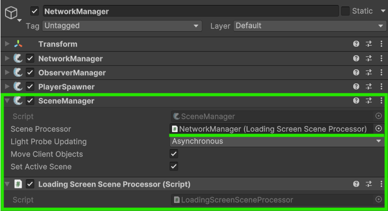

# Making a Loading Screen

You may be used to making loading screens when using Unity's regular scene loading, but how can you do it for networked scenes? A good and simple solution is to use FishNet's Scene Processor to add _(or override)_ functionality during when FishNet loads scenes.



### Creating a loading screen UI

Let's start by adding a canvas with an image and some text to cover the screen and let the user know that the game is currently loading and not just frozen.

<figure><figcaption></figcaption></figure>

We will disable and enable this object when needed, and to prevent it getting destroyed, we will mark it as [DontDestroyOnLoad](https://docs.unity3d.com/ScriptReference/Object.DontDestroyOnLoad.html).



### Adding a simple loading screen script

We can now write a really simple script and place it on our **Loading Screen** object.

This script will act as a singleton, as we will only have one loading screen in our game. To do this we will add a static reference to it and register it with the [NetworkManager](../../fishnet-building-blocks/components/managers/network-manager.md) in Start, or destroy it  if an instance is already registered. We will hide the loading screen after this, so it doesn't block our game before we want it to.


```csharp
using FishNet;
using UnityEngine;

public class LoadingScreen : MonoBehaviour
{
    private void Start()
    {
        if (InstanceFinder.NetworkManager.HasInstance<LoadingScreen>())
        {
            Destroy(gameObject);
            return;
        }

        InstanceFinder.NetworkManager.RegisterInstance(this);
        DontDestroyOnLoad(gameObject);
        HideLoadingScreen();
    }

    public static void ShowLoadingScreen()
    {
        if (InstanceFinder.NetworkManager.TryGetInstance(out LoadingScreen loadingScreen))
            loadingScreen.gameObject.SetActive(true);
    }

    public static void HideLoadingScreen()
    {
        if (InstanceFinder.NetworkManager.TryGetInstance(out LoadingScreen loadingScreen))
            loadingScreen.gameObject.SetActive(false);
    }
}
```


We will also give it public static methods to show and hide the loading screen. We can call these whenever we want to, and we will call them from our scene processor.


This example script uses FishNet's instance registering to handle the singleton reference, but you can use your own or any other instead if you prefer.




### Creating a custom scene processor

Now let's create a script that will inherit from FishNet's [DefaultSceneProcessor](https://fish-networking.com/FishNet/api/api/FishNet.Managing.Scened.DefaultSceneProcessor.html) and add our extra functionality when loading a scene. After inheriting from **DefaultSceneProcessor**, simply override the [LoadStart](https://app.gitbook.com/u/YSfkj2zWPbbIfmfInyrs7Ysa2DV2) and [LoadEnd](https://app.gitbook.com/u/YSfkj2zWPbbIfmfInyrs7Ysa2DV2) methods, call the base method to retain the default functionality and then tell our loading screen to be shown and hidden.&#x20;


```csharp
using FishNet.Managing.Scened;

public class LoadingScreenSceneProcessor : DefaultSceneProcessor
{
    public override void LoadStart(LoadQueueData queueData)
    {
        base.LoadStart(queueData);
        LoadingScreen.ShowLoadingScreen();
    }

    public override void LoadEnd(LoadQueueData queueData)
    {
        base.LoadEnd(queueData);
        LoadingScreen.HideLoadingScreen();
    }
}
```




### Add our scene processor to the NetworkManager

Now add the **LoadingScreenSceneProcessor** script we just created to your network manager game object. Also add the [SceneManager](../../fishnet-building-blocks/components/managers/scenemanager.md) component if it isn't there already. The SceneManager has a **Scene Processor** field which you need to drag your **LoadingScreenSceneProcessor** component into.

<figure><figcaption></figcaption></figure>



### Success!

With that all setup, your loading screen should work whenever FishNet loads new scenes.

<figure><figcaption></figcaption></figure>


