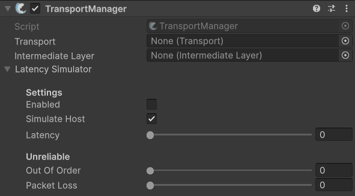

# Simulating Bad Network Connections

When developing a multiplayer game, it’s not enough to test only under perfect network conditions. Real-world players will often experience **latency**, **jitter**, **out of order packets,** and **packet loss**, and your game needs to tolerate these. If you only test on your local machine with a flawless connection, you risk shipping a game that breaks down as soon as it’s played online.

***

## What conditions affect networked games?

* **Latency (Ping)** — delays between sending and receiving packets.
* **Jitter** — variations in latency over time (unstable ping).
* **Out-of-order Packets** — packets may arrive out of the order from when they were sent.
* **Packet Loss** — some messages never arrive.

Testing with these factors early helps you tune interpolation, reconciliation, lag-compensation, and other systems. It also reveals edge cases that only show up at higher latencies (e.g., 500ms+).

***

## What values should I test with?

There’s no one-size-fits-all answer, but some general guidelines:

* **Desktop broadband**: 100–150ms latency, 1–3% packet loss
* **Mobile networks**: 100–300ms latency, 2–5% packet loss, plus jitter
* **Stress testing**: also check 500ms, 1000ms+, and extreme packet loss to ensure your game fails gracefully


Remember: don’t test with just “added delay.” Real networks get affected by multiple factors.


***

## FishNet’s built-in simulator

FishNet includes a basic latency simulator that can add artificial latency, packet loss, and tamper with packet order. These can also affect the client host player.

To use this, add the [TransportManager](../../fishnet-building-blocks/components/managers/transportmanager/) component to your network manager. You will now be able to enable the **Latency Simulator** and tweak its settings.

<figure><figcaption>
The <strong>Latency Simulator</strong> on the <strong>TransportManager</strong>
</figcaption></figure>

***

## External tools

For more options it's recommended to use an external tool, such as one of the ones listed below:

* **Windows**: [Clumsy](https://jagt.github.io/clumsy/)
* **macOS/iOS**: [Network Link Conditioner](https://app.gitbook.com/u/YSfkj2zWPbbIfmfInyrs7Ysa2DV2) (in Apple’s Additional Tools for Xcode)
* **macOS (advanced)**: [dummynet](https://manpagez.com/man/8/dnctl/), dnctl and pfctl (built into macOS)
* **Linux:** [netem](https://wiki.linuxfoundation.org/networking/netem)

These tools let you add latency, packet loss, bandwidth limits, and more. They operate at the system level, so every application (including your game) experiences the degraded connection.
