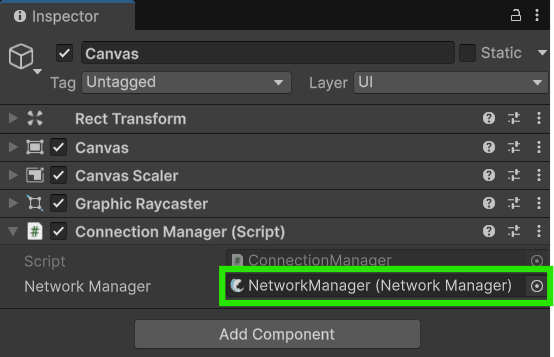

# Starting FishNet's Connections

This guide will show you how you can start the FishNet server and client yourself through code instead of relying only on the example [networkhudcanvas.md](../../fishnet-building-blocks/prefabs/networkhudcanvas.md "mention") or default [autostart](../../fishnet-building-blocks/components/managers/server-manager.md#start-on-headless) option.



### Install FishNet

Before we begin, don't forget to install FishNet if you haven't already. You can follow this guide if needed: [installing-fish-networking.md](../getting-started/installing-fish-networking.md "mention")



### Create a NetworkManager

Create a new game object in your scene and give it a nice name such as `NetworkManager`.

Add the [NetworkManager component](../../fishnet-building-blocks/components/managers/network-manager.md) to it.

Finally, add an [ObserverManager component](../../fishnet-building-blocks/components/managers/observermanager/) and in the **Default Conditions** field, add a new element and select the [SceneCondition](../../fishnet-building-blocks/scriptableobjects/observerconditions/scenecondition.md).

<figure><figcaption><p>The NetworkManager components</p></figcaption></figure>



### Setup basic UI

To get started, let's add a basic user interface which we can use to start the FishNet server, client, and allow the user to enter an IP Address to connect to.

Add three buttons to your game, label them **Start Host**, **Start Server**, and **Start Client**. Now add an input field for the address the client will attempt to connect to.

<figure><figcaption><p>The scene setup</p></figcaption></figure>


You can download the graphics used above here:

<a href="https://github.com/maxkratt/fish-networking-starting-connections/releases/download/v1.0-starting-connections-guide/Graphics.zip" class="button primary" data-icon="down-to-line">Download</a>




### Create a ConnectionManager script

Let's now create the following script and add it to our [**Canvas**](#user-content-fn-1)[^1] game object.


```csharp
using FishNet.Managing;
using UnityEngine;

public class ConnectionManager : MonoBehaviour
{
    [SerializeField] NetworkManager networkManager;

    // A host is simply a server and a client, so start them both.
    public void StartHost()
    {
        StartServer();
        StartClient();
    }

    // The server can be started directly from the ServerManager or Transport
    public void StartServer()
    {
        networkManager.ServerManager.StartConnection();
    }

    // The client can be started directly from the ClientManager or Transport
    public void StartClient()
    {
        networkManager.ClientManager.StartConnection();
    }

    // This is set on the Transport to indicate where the client should connect.
    public void SetIPAddress(string text)
    {
        networkManager.TransportManager.Transport.SetClientAddress(text);
    }
}

```


The code show here is very simple, but one thing to observe is that the script does not inherit from [NetworkBehaviour](../../fishnet-building-blocks/components/network-behaviour-components.md). This is because this script will be active before the network is started and after it has stopped.



### Assign the NetworkManager

Our **ConnectionManager** needs a reference to the NetworkManager component, assign that in the editor now.

<figure><figcaption><p>ConnectionManager assigned a NetworkManager</p></figcaption></figure>



### Hook-up the UI to the code

Now select your UI components and attach their OnClick events to the relevant methods in our ConnectionManager.

<figure><figcaption><p>Hooking up the host button</p></figcaption></figure>

For the IP Address Input Field, you can hook up the **On Value Changed** event to the `ConnectionManager.SetIPAddress` method we created.

<figure><figcaption><p>Setting the IP address input field</p></figcaption></figure>



### Test it out!

With that all done you should be able to run the game and use the UI we created to start the FishNet server and/or client.

<figure><figcaption></figcaption></figure>

You should try extending these buttons to also include stopping the server and clients, you can do those actions directly from the [ServerManager](../../guides/fishnet-building-blocks/components/managers/server-manager.md) and [ClientManager](../../guides/fishnet-building-blocks/components/managers/clientmanager.md) components as well.




Download the project files with these completed steps here, or explore the repository:

<a href="https://github.com/maxkratt/fish-networking-starting-connections/releases/download/v1.0-starting-connections-guide/starting-connections.unitypackage" class="button primary" data-icon="down-to-line">Source Files</a> <a href="https://github.com/maxkratt/fish-networking-starting-connections" class="button secondary" data-icon="github">Repository</a>


[^1]: Or any other object in the scene you prefer.
