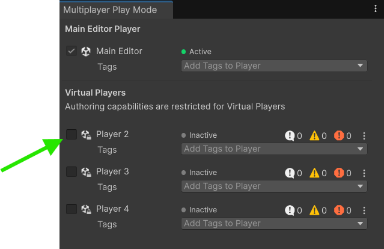
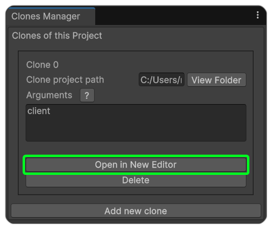

# Testing with Multiple Editors

During your multiplayer game development, you may find it useful to run multiple Unity editors to test out your project locally. This can be especially helpful if you want to use the Unity Inspector or Scene Hierarchy to analyze your game at runtime. While you could do this by duplicating your project's files and opening them in a new Unity editor instance, you will run into issues of keeping the projects in sync with one another, among other things.

This tutorial will go over two solutions to the problem. Firstly by using Unity's own multiplayer tool called [**Multiplayer Play Mode**](https://docs.unity3d.com/Packages/com.unity.multiplayer.playmode@2.0/manual/index.html), and then by using a community extension called [**ParrelSync**](https://github.com/VeriorPies/ParrelSync?tab=readme-ov-file#parrelsync).

## Multiplayer Play Mode vs ParrelSync

Before we start, let's briefly look over the differences between the two so you know which one to choose for your project.

|                   | ParrelSync                                                                                                                                                                                                                                                                                             | Multiplayer Play Mode                                                                                                                                                                                                                                                                                                                                                                                                                                                                                                                                                                                                                                                                  |
| ----------------- | ------------------------------------------------------------------------------------------------------------------------------------------------------------------------------------------------------------------------------------------------------------------------------------------------------ | -------------------------------------------------------------------------------------------------------------------------------------------------------------------------------------------------------------------------------------------------------------------------------------------------------------------------------------------------------------------------------------------------------------------------------------------------------------------------------------------------------------------------------------------------------------------------------------------------------------------------------------------------------------------------------------- |
| **Author**        | Community (VeriorPies)                                                                                                                                                                                                                                                                                 | Unity                                                                                                                                                                                                                                                                                                                                                                                                                                                                                                                                                                                                                                                                                  |
| **Compatibility** | Works with most Unity versions                                                                                                                                                                                                                                                                         | Unity 6 and later                                                                                                                                                                                                                                                                                                                                                                                                                                                                                                                                                                                                                                                                      |
| **Editor Limit**  | No Limit                                                                                                                                                                                                                                                                                               | 4 Editor Clones                                                                                                                                                                                                                                                                                                                                                                                                                                                                                                                                                                                                                                                                        |
| **Limitations**   | Changes should be made on main editor                                                                                                                                                                                                                                                                  | Clone instances are stripped down versions of the Unity editor with limited functionality                                                                                                                                                                                                                                                                                                                                                                                                                                                                                                                                                                                              |
| **Development**   | Stable, but inactive                                                                                                                                                                                                                                                                                   | Actively developed                                                                                                                                                                                                                                                                                                                                                                                                                                                                                                                                                                                                                                                                     |
| **Features**      | Supports [clone detection](https://github.com/VeriorPies/ParrelSync/wiki/List-of-APIs#clonesmanagerisclone), [editor arguments](https://github.com/VeriorPies/ParrelSync/wiki/Argument), and synchronized play mode (through a 3rd party extension, [ParrelLink](https://tactifail.itch.io/parrelink)) | Supports[ clone detection](https://docs.unity3d.com/Packages/com.unity.multiplayer.playmode@2.0/manual/multiplayer-role.html), [tags](https://docs.unity3d.com/Packages/com.unity.multiplayer.playmode@2.0/manual/player-tags/player-tags.html), [scenarios](https://docs.unity3d.com/Packages/com.unity.multiplayer.playmode@2.0/manual/play-mode-scenario/play-mode-scenario-create.html), [remote instances](https://docs.unity3d.com/Packages/com.unity.multiplayer.playmode@2.0/manual/play-mode-scenario/play-mode-scenario-configure-build.html), and [synchronized play mode](https://docs.unity3d.com/Packages/com.unity.multiplayer.playmode@2.0/manual/sync-play-mode.html) |

If you are using a Unity version older than Unity 6, you will have to use ParrelSync, otherwise you can choose either option, or even both.

***

## Multiplayer Play Mode (MPPM)

The Multiplayer Play Mode package is a newer, official Unity solution for local and remote multiplayer testing. It allows you to simulate multiple players (up to four) directly within a single editor instance. As well as create specific scenarios for testing.



### Install MPPM

1. Open the Package Manager in Unity (**Window → Package Manager**).
2. Select "**Unity Registry"** in the dropdown.
3. Find **Multiplayer Play Mode** in the Packages listing and click **Install**.

<figure><figcaption><p>Installing from the Unity Package Manager</p></figcaption></figure>

Or alternatively:

1. Open the Package Manager in Unity (**Window → Package Manager**).
2. Click the + dropdown button and then select "**Install package by name"**.
3. Enter the following and then press **Install.**

```
com.unity.multiplayer.playmode
```



### Create your Clones

Open the MPPM window (**Window → Multiplayer → Multiplayer Play Mode**) and click the checkbox next to one of the four Virtual Player options:

After the clone creates the necessary files, it will open a&#x20;

<figure><figcaption><p>Activating a clone instance</p></figcaption></figure>



### Customize your Clone Window

Now that your clone window has opened, you can choose which Unity tabs you want to show in it, such as the scene hierarchy, inspector, and console.

That's all you need to do! Now as soon as you start your main project, the clones will all enter play mode as well.

<figure><figcaption><p>Clone window layout options</p></figcaption></figure>


If the options are disabled, try changing them at run-time instead.




You can learn more about the other features available and how to set them up from the official documentation: [https://docs.unity3d.com/Packages/com.unity.multiplayer.playmode@2.0/manual/index.html](https://docs.unity3d.com/Packages/com.unity.multiplayer.playmode@2.0/manual/index.html)

***

## ParrelSync

ParrelSync is a popular, open-source Unity extension that creates multiple clones of your project, allowing you to run a multiple editor windows that reference the same core assets. This is an efficient and powerful way to test multiplayer interactions locally.



### Install ParrelSync

The recommended method is to use the Unity Package Manager.

1. Open the Package Manager in Unity (**Window → Package Manager**).
2. Click the + dropdown and select "**Install package from git URL**".
3. Enter the following URL and then click **Install**:&#x20;

```
https://github.com/VeriorPies/ParrelSync.git?path=/ParrelSync
```


Ensure you have the [Git client](https://git-scm.com/) (minimum version 2.14.0) installed on your system and added to the PATH system environment variable.


Or alternatively:

1. Download the latest `unitypackage` file from the [releases](https://github.com/VeriorPies/ParrelSync/releases) page.
2. From the toolbar menu choose, **Assets → Import Package →**
   \
   **Custom Package.**
3. Browse to the downloaded `unitypackage` and import it.



### Create and Test your Clones

From the menu bar, open the ParrelSync Clones Manager (**ParrelSync → Clones Manager**). You'll be able to delete, browse, create new clones, as well as set the arguments to use for each.

Now from the **Clones Manager** window, click **Create new clone**. This will create a new folder next to your original project and copy the necessary files. After the clone is created, select **Open in New Editor** to launch the cloned project in a new Unity window.

You can now press Play in both the original and the cloned editor windows to test your multiplayer game with two separate "players."

<figure><figcaption></figcaption></figure>


It's important to only make changes to your project from the original editor instance, not the cloned one, to avoid potential asset conflicts. ParrelSync disables asset modification in clones by default.




***

## Final Comments

With either of those options setup you can now easily test your game with multiple editors without needing to rebuild each time.

In the example below we have started the main editor instance as a client and server and the second editor instance as a client.

<figure><figcaption></figcaption></figure>
